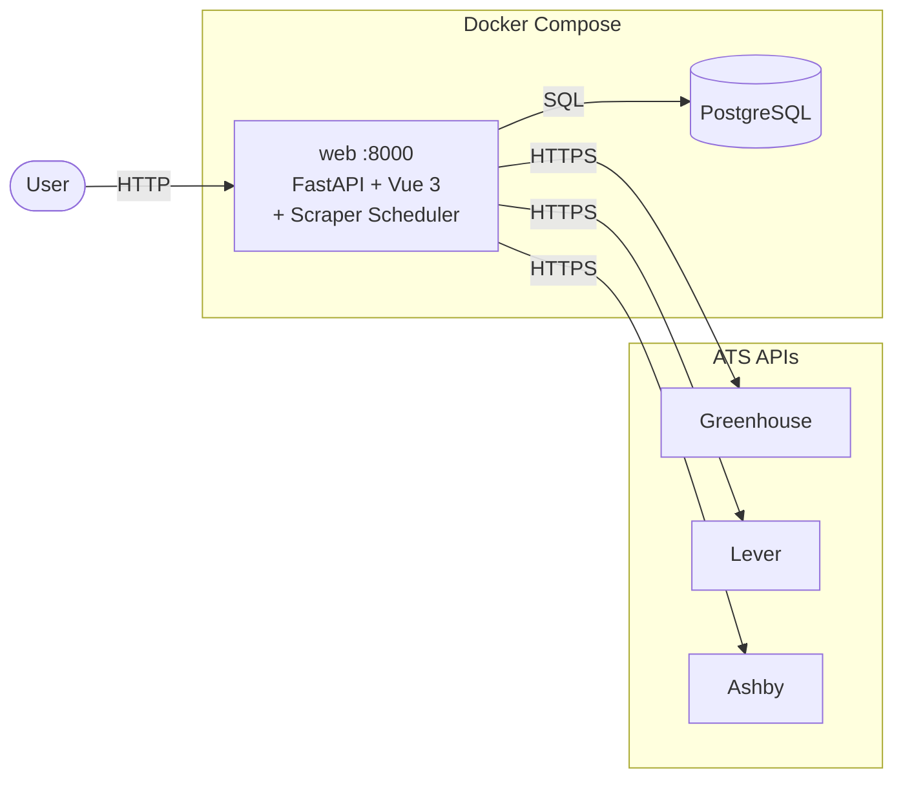
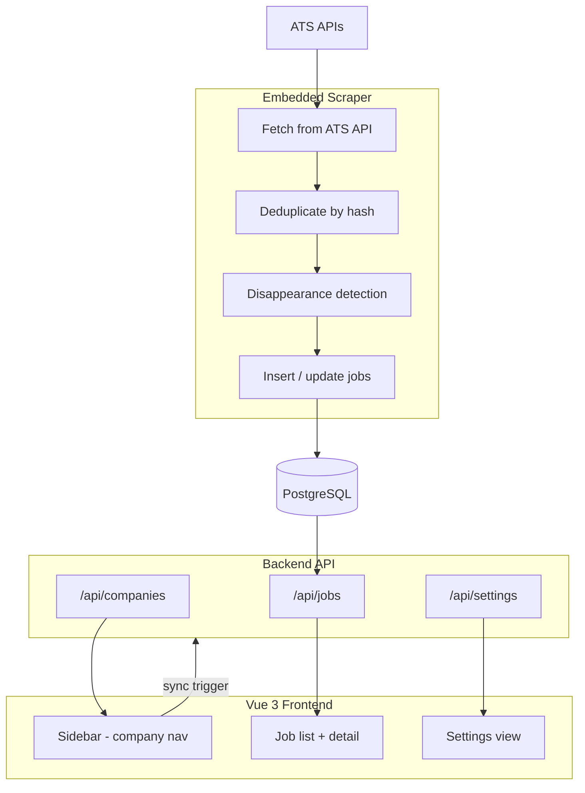

# HireWire

> **Status: v0.2.0** — Company-first ATS tracker, fully functional.

A self-hosted job tracker that monitors employer ATS job boards directly. Add companies you care about; HireWire polls Greenhouse, Lever, and Ashby APIs automatically and surfaces new roles in a single dashboard.

## Implementation Status

- ATS scraping (Greenhouse, Lever, Ashby) — Done
- Company tracking (add / delete / sync) — Done
- Company-first sidebar UI — Done
- On-demand sync (per-company + global) — Done
- Scheduled sync — Done (9 AM + 5 PM UTC, embedded in web process)
- Disappearance detection — Done
- Full HTML job descriptions — Done
- Favorites — Done
- Settings: preferred locations — Done
- Settings: included/excluded keywords — Done
- Settings: remote toggle — Done
- Full-text search — Done (PostgreSQL tsvector)
- Application tracking — Deferred (schema placeholder exists)
- K8s deployment — Future

## Architecture

## Data Flow

## Component Overview

### Backend (`backend/src/`)

- `main.py` — FastAPI app, CORS, static file serving, lifespan, embedded scraper scheduler
- `routers/companies.py` — Company CRUD + sync trigger endpoints
- `routers/jobs.py` — Job listing with full filter engine
- `routers/favorites.py` — Favorite / unfavorite jobs
- `routers/settings.py` — User settings (locations, keywords, remote)
- `routers/stats.py` — Aggregate statistics
- `models/` — SQLAlchemy ORM models
- `schemas/` — Pydantic request/response schemas

### Scraper (`scraper/src/`)

- `main.py` — Scrape orchestration: fetch → normalize → dedup → insert → disappearance check
- `scrapers/` — `AshbyScraper`, `GreenhouseScraper`, `LeverScraper` (all extend `BaseScraper`)
- `db.py` — asyncpg connection pool + raw SQL queries
- `dedup.py` — SHA-256 hash-based deduplication
- `utils.py` — `parse_location()`, `parse_iso()` helpers

### Frontend (`frontend/src/`)

- `components/Sidebar.vue` — Company list nav with add/delete/sync/sync-all
- `components/AddCompanyModal.vue` — URL-based ATS detection + company form
- `components/JobList.vue` — Paginated job list
- `components/JobDetail.vue` — Full job description panel
- `stores/companies.ts` — Pinia store for tracked companies
- `stores/jobs.ts` — Pinia store for job list + filters

## Roadmap

### Done (v0.2.0)

- Company-first ATS tracker
- Greenhouse, Lever, Ashby integration
- Scheduled + on-demand sync (embedded scheduler)
- Full-text search, location/keyword filters
- Favorites

### Near-term

- Advanced job filtering (function/department/level)
- Keyboard navigation

### Future / Deferred

- Application status tracking (applied, interviewing, offer, rejected)
- K8s deployment
- Multi-user support

## Related Docs

- [ATS Scraping Tools](scraping-tools.md)
- [Scraper Service Design](scraper-service.md)
- [API Backend Spec](api-backend.md)
- [Frontend Spec](frontend.md)
- [Infrastructure & CI/CD](infra-cicd.md)
