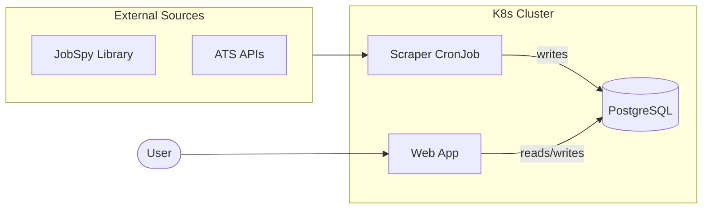
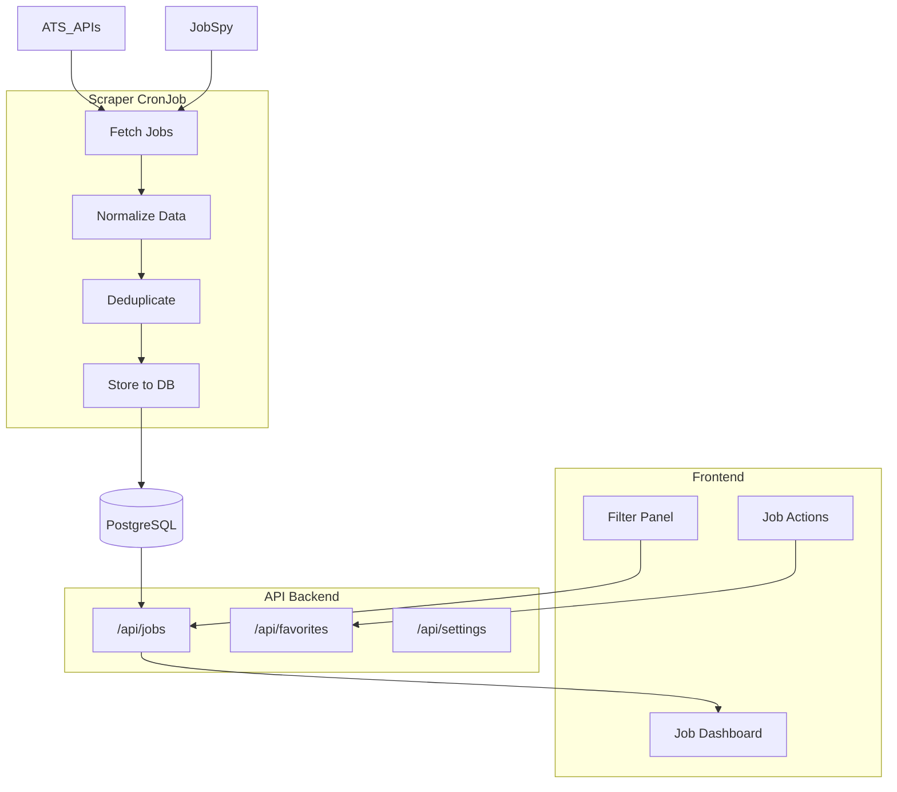
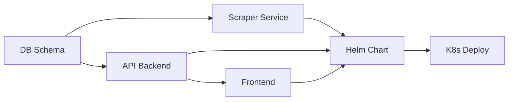

# HireWire - Job Search Aggregator

> **Status: Phase 2 Complete** — Core scraping, filtering, display, and UX improvements implemented.

A self-hosted job search aggregator that helps find marketing/SEO/content roles at startups by scraping multiple sources, deduplicating listings, and presenting them in a clean dashboard.

## Implementation Status

| Feature | Status | Notes |
|---------|--------|-------|
| JobSpy scraping (Indeed, Glassdoor) | Done | Via python-jobspy library |
| PostgreSQL with full-text search | Done | Deduplication, search_vector |
| FastAPI backend | Done | Jobs, favorites, settings, sync endpoints |
| Vue 3 frontend | Done | Dark mode, filter panel, job detail |
| Manual sync trigger | Done | Button in sidebar |
| Comma-separated OR search | Done | e.g., "python, java" |
| Favorites & hidden jobs | Done | Phase 2 - with undo support |
| Search configurations | Done | Phase 2 - multi-country support |
| K8s deployment | Done | Helm chart with CronJob |
| Keyboard navigation | Done | j/k nav, shortcuts for actions |
| Viewed job tracking | Done | Persistent via localStorage |
| Accessibility improvements | Done | ARIA labels, 44px touch targets |
| ATS integration (Ashby, etc.) | Planned | Phase 3 |
| Application tracking | Planned | Phase 4 |

## Contents

- [Overview](#overview)
- [Architecture](#architecture)
- [Component Interdependencies](#component-interdependencies)
- [Integration Points](#integration-points)
- [Phase Roadmap](#phase-roadmap)
- [Related Plans](#related-plans)

## Overview

HireWire aggregates job listings from multiple sources to get ahead of typical LinkedIn/Indeed postings:

1. **Major aggregators** via JobSpy (Indeed, LinkedIn, Glassdoor, ZipRecruiter)
2. **Direct ATS APIs** (Greenhouse, Lever, Ashby) for early access to startup postings
3. **Startup-focused sources** (YC companies, Wellfound)

The system runs as two K8s workloads:
- **Scraper CronJob**: Runs every 1-2 hours, fetches jobs, deduplicates, stores to Postgres
- **Web App Deployment**: FastAPI backend + Linear-style dark mode frontend

## Goal and Definition of Done

### Primary Goal

Enable efficient job searching for marketing/SEO/analytics/content positions at startups by:
- Aggregating listings from multiple sources in one place
- Catching jobs early (before they hit major boards)
- Filtering by role type, company size, location, remote status
- Tracking favorites and application status

### Definition of Done

**Phase 1 MVP - Complete:**
- [x] Scraper successfully fetches jobs from Indeed/Glassdoor via JobSpy
- [x] Jobs stored in Postgres with deduplication
- [x] Basic web UI displays jobs with filtering
- [x] Deployed to K3s and accessible via ingress

**Phase 2 - Complete:**
- [x] Filter by title keywords, company size, location, remote
- [x] Mark jobs as favorites
- [x] Hide/dismiss unwanted jobs (with undo)
- [x] Search settings persist
- [x] Manual sync trigger from UI
- [x] Keyboard navigation (j/k, f, h, Enter, /)
- [x] Viewed job tracking with visual indicator
- [x] Accessibility improvements (ARIA, touch targets)
- [x] Multi-country search configuration

**Phase 3 - Planned:**
- [ ] Direct ATS integration (Greenhouse, Lever, Ashby)
- [ ] Track specific companies
- [ ] Jobs appear from tracked companies within 2 hours of posting

**Phase 4 - Planned:**
- [ ] Track application status (applied, interviewing, rejected, offer)
- [ ] Notes on individual jobs
- [ ] Application timeline/history

## Architecture

See individual plan files for detailed component designs:

- [scraping-tools.md](scraping-tools.md) — Analysis of available scraping libraries and APIs
- [scraper-service.md](scraper-service.md) — Scraper container design, scheduling, deduplication
- [api-backend.md](api-backend.md) — FastAPI service, endpoints, database schema
- [frontend.md](frontend.md) — UI framework, features, Linear-style design
- [infra-cicd.md](infra-cicd.md) — K8s deployment, Helm charts, CI/CD

### High-Level Data Flow

## Component Interdependencies

### Scraper → Database

The scraper writes directly to Postgres. Schema must be defined before scraper can run.

**Dependency**: `api-backend.md` database schema must be implemented first.

### API → Database

FastAPI reads from Postgres. Uses SQLAlchemy for ORM.

**Shared with scraper**: Same database, same schema, same connection config.

### Frontend → API

Frontend consumes REST API. API contract defines the interface.

**Dependency**: API endpoints must be defined before frontend development.

### Scraper Config → Frontend Settings

User-configurable search terms, locations, etc. stored in DB, consumed by scraper.

**Dependency**: Settings schema shared between scraper and frontend.

### Build Order

## Integration Points

### External Services

| Service | Purpose | Auth Required |
|---------|---------|---------------|
| Indeed (via JobSpy) | Job listings | No (rate limited) |
| LinkedIn (via JobSpy) | Job listings | No (heavily rate limited, needs proxies) |
| Glassdoor (via JobSpy) | Job listings | No |
| Greenhouse API | Direct ATS access | No (public endpoints) |
| Lever API | Direct ATS access | No (public endpoints) |
| Ashby API | Direct ATS access | No (public endpoints) |

### Internal Services

| Service | Purpose | Connection |
|---------|---------|------------|
| PostgreSQL | Job storage | Direct connection from scraper + API |
| Traefik | Ingress | Routes external traffic to web app |
| Cloudflare | DNS/TLS | External access via tunnel |

### Shared Configuration

- **Database connection**: Shared secret, same for scraper and API
- **Search config**: Stored in DB, read by scraper, written by frontend
- **Company watchlist**: Stored in DB, used by scraper for ATS polling

## Phase Roadmap

### Phase 1: MVP (Current)

Build core scraping and display functionality.

- Scraper container with JobSpy
- PostgreSQL schema
- FastAPI with `/api/jobs` endpoint
- Minimal frontend (job list + basic filters)
- Helm chart for K8s deployment

### Phase 2: Filtering and UX

Improve filtering and add user interactions.

- Advanced filter engine
- Favorites and hide functionality
- Improved dashboard UI
- Search settings persistence

### Phase 3: ATS Integration

Add direct company tracking.

- Greenhouse/Lever/Ashby API integration
- Company watchlist feature
- YC companies seed data

### Phase 4: Application Tracking

Full job search workflow support.

- Application status tracking
- Notes per job
- Interview scheduling (optional)
- Notification integration (optional)

## Related Plans

- [scraping-tools.md](scraping-tools.md) — Detailed analysis of scraping options
- [scraper-service.md](scraper-service.md) — Scraper implementation details
- [api-backend.md](api-backend.md) — API and database design
- [frontend.md](frontend.md) — UI/UX specification
- [infra-cicd.md](infra-cicd.md) — Deployment and CI/CD

## External References

- [JobSpy GitHub](https://github.com/speedyapply/JobSpy) — Primary scraping library
- [Greenhouse API](https://developers.greenhouse.io/) — ATS API docs
- [Lever API](https://hire.lever.co/developer/documentation) — ATS API docs
- [Ashby API](https://developers.ashbyhq.com/) — ATS API docs
