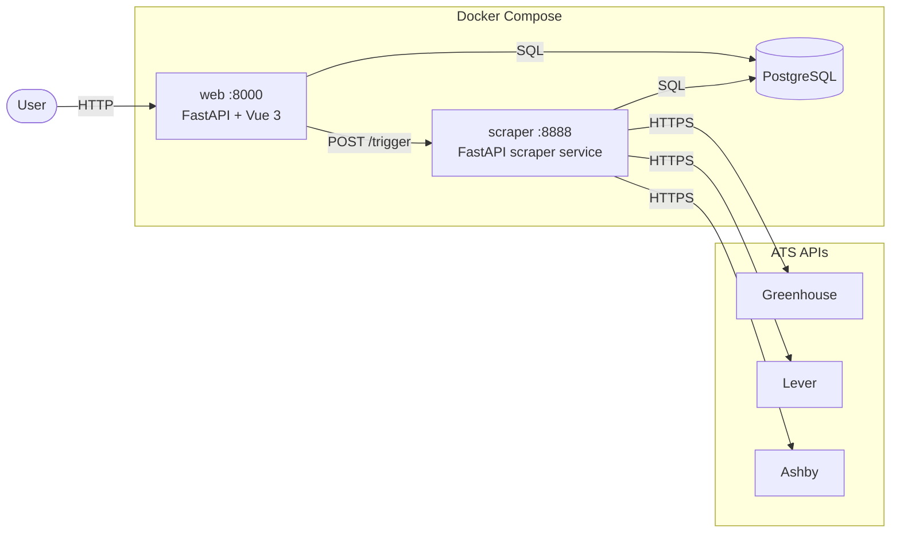
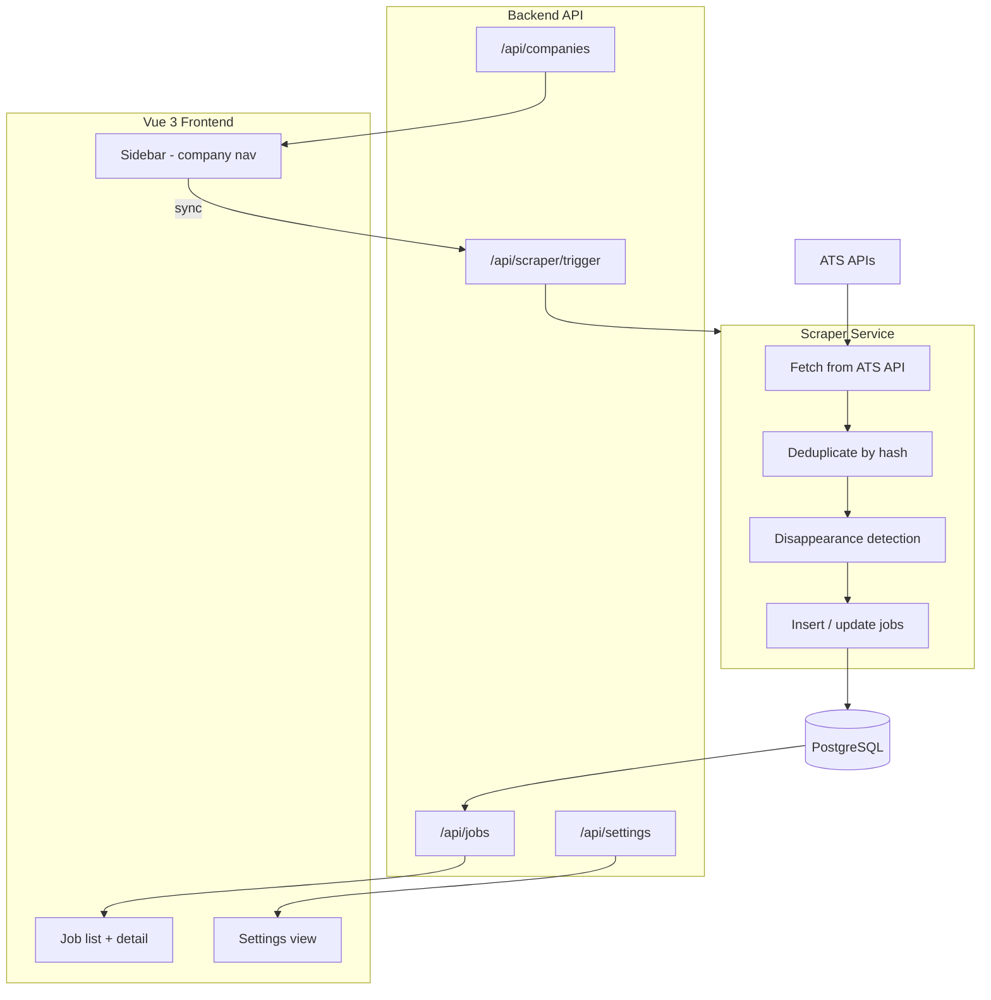

# HireWire

> **Status: v0.2.0** — Company-first ATS tracker, fully functional.

A self-hosted job tracker that monitors employer ATS job boards directly. Add companies you care about; HireWire polls Greenhouse, Lever, and Ashby APIs automatically and surfaces new roles in a single dashboard.

## Implementation Status

| Feature | Status | Notes |
|---------|--------|-------|
| ATS scraping (Greenhouse, Lever, Ashby) | Done | Direct unauthenticated APIs |
| Company tracking (add / delete / sync) | Done | URL auto-detection of ATS type + slug |
| Company-first sidebar UI | Done | Sorted by recent activity, job count badges |
| On-demand sync (per-company + global) | Done | Buttons in sidebar, immediate post-add sync |
| Scheduled sync | Done | 9 AM + 5 PM UTC via scraper service |
| Disappearance detection | Done | Jobs marked inactive when removed from ATS |
| Full HTML job descriptions | Done | Greenhouse, Lever, Ashby all render correctly |
| Favorites | Done | Star any job, view in Favorites tab |
| Settings: preferred locations | Done | Chip/tag input, OR filter |
| Settings: included/excluded keywords | Done | Title keyword filters |
| Settings: remote toggle | Done | Suppresses location filters when active |
| Full-text search | Done | PostgreSQL tsvector across title + description |
| Application tracking | Deferred | Schema placeholder exists |
| K8s deployment | Future | Not currently active |

## Architecture

## Data Flow

## Component Overview

### Backend (`backend/src/`)

- `main.py` — FastAPI app, CORS, static file serving, lifespan
- `routers/companies.py` — Company CRUD + sync trigger endpoints
- `routers/jobs.py` — Job listing with full filter engine
- `routers/favorites.py` — Favorite / unfavorite jobs
- `routers/settings.py` — User settings (locations, keywords, remote)
- `routers/stats.py` — Aggregate statistics
- `models/` — SQLAlchemy ORM models
- `schemas/` — Pydantic request/response schemas

### Scraper (`scraper/src/`)

- `server.py` — FastAPI service; `/trigger` and `/trigger/company/{id}` endpoints + schedule loop
- `main.py` — Scrape orchestration: fetch → normalize → dedup → insert → disappearance check
- `scrapers/` — `AshbyScraper`, `GreenhouseScraper`, `LeverScraper` (all extend `BaseScraper`)
- `db.py` — asyncpg connection pool + raw SQL queries
- `dedup.py` — SHA-256 hash-based deduplication
- `utils.py` — `parse_location()` helper

### Frontend (`frontend/src/`)

- `components/Sidebar.vue` — Company list nav with add/delete/sync/sync-all
- `components/AddCompanyModal.vue` — URL-based ATS detection + company form
- `components/JobList.vue` — Paginated job list
- `components/JobDetail.vue` — Full job description panel
- `stores/companies.ts` — Pinia store for tracked companies
- `stores/jobs.ts` — Pinia store for job list + filters
- `stores/settings.ts` — Pinia store for user settings
- `stores/favorites.ts` — Pinia store for favorited jobs

## Roadmap

### Done (v0.2.0)

- Company-first ATS tracker
- Greenhouse, Lever, Ashby integration
- Scheduled + on-demand sync
- Full-text search, location/keyword filters
- Favorites

### Near-term

- Consolidate scraper into backend process (eliminate second container)
- Advanced job filtering (function/department/level)
- Keyboard navigation

### Future / Deferred

- Application status tracking (applied, interviewing, offer, rejected)
- K8s deployment
- Multi-user support

## Related Docs

- [ATS Scraping Tools](scraping-tools.md)
- [Scraper Service Design](scraper-service.md)
- [API Backend Spec](api-backend.md)
- [Frontend Spec](frontend.md)
- [Infrastructure & CI/CD](infra-cicd.md)
