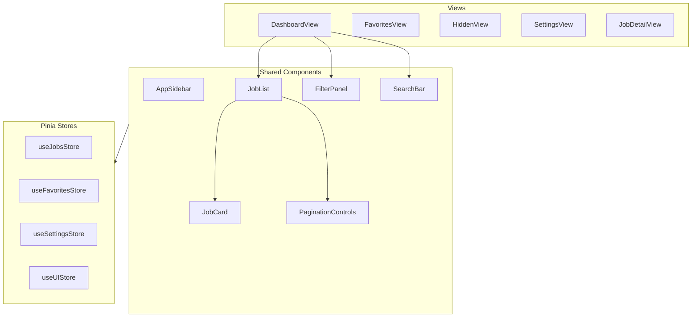

# HireWire - Frontend

> Complete design specification for the Vue 3 + Vite frontend with Linear-inspired dark mode UI.

## Contents

- [Overview](#overview)
- [Tech Stack](#tech-stack)
- [Design System](#design-system)
- [Project Structure](#project-structure)
- [TypeScript Interfaces](#typescript-interfaces)
- [Pinia Stores](#pinia-stores)
- [Vue Router Configuration](#vue-router-configuration)
- [API Integration](#api-integration)
- [Component Specifications](#component-specifications)
- [Auth-Ready Architecture](#auth-ready-architecture)
- [Build and Deployment](#build-and-deployment)

## Overview

The frontend is a single-page application built with Vue 3 Composition API that displays job listings with filtering, favorites, and application tracking. The design follows Linear's aesthetic: dark mode, clean typography, subtle animations.



## Tech Stack

| Component | Technology | Version | Rationale |
|-----------|------------|---------|-----------|
| Framework | Vue 3 | 3.4+ | Composition API, `<script setup>`, excellent DX |
| Build Tool | Vite | 5.x | Fast HMR, optimized builds |
| State | Pinia | 2.x | Official Vue store, TypeScript-first |
| Router | Vue Router | 4.x | Official router, type-safe routes |
| Language | TypeScript | 5.x | Type safety, IDE support |
| HTTP | fetch | native | No extra dependency, async/await |
| CSS | Scoped CSS + Variables | - | Component isolation, theming |

## Design System

### Complete CSS Variables (from firekit)

```css
/* =============================================================================
   HireWire Design System - Linear-Inspired Dark Mode
   Extracted from firekit reference implementation
   ============================================================================= */

:root {
  /* =========================================================================
     Colors - Background Scale
     ========================================================================= */
  --bg-base: #0f0f12;        /* Deepest background - page background */
  --bg-surface: #18181c;     /* Card/panel background */
  --bg-elevated: #222228;    /* Hover states, inputs, elevated elements */
  --bg-highlight: #2a2a32;   /* Active/selected states */
  
  /* =========================================================================
     Colors - Border Scale
     ========================================================================= */
  --border-subtle: #2d2d35;  /* Default borders */
  --border-strong: #3d3d45;  /* Hover borders, dividers */
  
  /* =========================================================================
     Colors - Text Scale
     ========================================================================= */
  --text-primary: #f5f5f7;   /* Primary text, headings */
  --text-secondary: #a8a8b3; /* Secondary text, descriptions */
  --text-muted: #8a8a96;     /* Muted text, placeholders, timestamps */
  
  /* =========================================================================
     Colors - Accent Palette
     ========================================================================= */
  --accent-gold: #f0a030;    /* Primary brand accent */
  --accent-amber: #e8b84a;   /* Gold hover state */
  --accent-green: #4ade80;   /* Success, positive states */
  --accent-red: #f87171;     /* Error, danger states */
  --accent-blue: #60a5fa;    /* Links, information */
  --accent-purple: #a78bfa;  /* Tags, categories */
  --accent-teal: #2dd4bf;    /* Secondary accent */
  
  /* =========================================================================
     Typography
     ========================================================================= */
  --font-sans: 'Inter', -apple-system, BlinkMacSystemFont, 'Segoe UI', Roboto, sans-serif;
  --font-mono: 'JetBrains Mono', 'Fira Code', 'Consolas', monospace;
  
  /* Type Scale */
  --text-xs: 0.6875rem;    /* 11px - micro labels */
  --text-sm: 0.75rem;      /* 12px - small labels */
  --text-base: 0.875rem;   /* 14px - body text */
  --text-md: 0.9375rem;    /* 15px - emphasized body */
  --text-lg: 1rem;         /* 16px - subheadings */
  --text-xl: 1.125rem;     /* 18px - section titles */
  --text-2xl: 1.25rem;     /* 20px - page titles */
  --text-3xl: 1.5rem;      /* 24px - large headings */
  
  /* Font Weights */
  --font-normal: 400;
  --font-medium: 500;
  --font-semibold: 600;
  --font-bold: 700;
  
  /* Line Heights */
  --leading-tight: 1.25;
  --leading-normal: 1.5;
  --leading-relaxed: 1.6;
  
  /* =========================================================================
     Spacing Scale
     ========================================================================= */
  --space-0: 0;
  --space-1: 0.25rem;   /* 4px */
  --space-2: 0.5rem;    /* 8px */
  --space-3: 0.75rem;   /* 12px */
  --space-4: 1rem;      /* 16px */
  --space-5: 1.25rem;   /* 20px */
  --space-6: 1.5rem;    /* 24px */
  --space-8: 2rem;      /* 32px */
  --space-10: 2.5rem;   /* 40px */
  --space-12: 3rem;     /* 48px */
  
  /* =========================================================================
     Layout
     ========================================================================= */
  --nav-width: 220px;
  --nav-width-collapsed: 60px;
  --content-max-width: 1200px;
  --card-padding: 24px;
  --card-radius: 12px;
  --section-gap: 16px;
  
  /* =========================================================================
     Transitions
     ========================================================================= */
  --transition-fast: 0.1s ease;
  --transition-base: 0.15s ease;
  --transition-slow: 0.2s ease;
  
  /* =========================================================================
     Shadows
     ========================================================================= */
  --shadow-sm: 0 1px 2px rgba(0, 0, 0, 0.2);
  --shadow-md: 0 4px 6px rgba(0, 0, 0, 0.25);
  --shadow-lg: 0 8px 16px rgba(0, 0, 0, 0.3);
  --shadow-xl: 0 12px 24px rgba(0, 0, 0, 0.4);
  
  /* =========================================================================
     Z-Index Scale
     ========================================================================= */
  --z-dropdown: 100;
  --z-sticky: 200;
  --z-modal-backdrop: 900;
  --z-modal: 1000;
  --z-toast: 1100;
}

/* =========================================================================
   Global Reset & Base Styles
   ========================================================================= */
*, *::before, *::after {
  box-sizing: border-box;
  margin: 0;
  padding: 0;
}

html {
  scroll-behavior: smooth;
  font-size: 16px;
}

body {
  font-family: var(--font-sans);
  font-size: var(--text-base);
  line-height: var(--leading-normal);
  color: var(--text-primary);
  background: var(--bg-base);
  min-height: 100vh;
  -webkit-font-smoothing: antialiased;
  -moz-osx-font-smoothing: grayscale;
}

/* =========================================================================
   Scrollbar Styling
   ========================================================================= */
::-webkit-scrollbar {
  width: 8px;
  height: 8px;
}

::-webkit-scrollbar-track {
  background: var(--bg-base);
}

::-webkit-scrollbar-thumb {
  background: var(--border-subtle);
  border-radius: 4px;
}

::-webkit-scrollbar-thumb:hover {
  background: var(--border-strong);
}
```

### Component Style Blocks

```css
/* =============================================================================
   Card Component
   ============================================================================= */
.card {
  background: var(--bg-surface);
  border: 1px solid var(--border-subtle);
  border-radius: var(--card-radius);
  padding: var(--card-padding);
  transition: border-color var(--transition-base);
}

.card:hover {
  border-color: var(--border-strong);
}

.card-header {
  display: flex;
  align-items: center;
  gap: var(--space-3);
  margin-bottom: var(--space-4);
  padding-bottom: var(--space-3);
  border-bottom: 1px solid var(--border-subtle);
}

.card-title {
  font-size: var(--text-md);
  font-weight: var(--font-semibold);
  color: var(--text-primary);
}

/* =============================================================================
   Button Component
   ============================================================================= */
.btn {
  display: inline-flex;
  align-items: center;
  justify-content: center;
  gap: var(--space-2);
  padding: var(--space-2) var(--space-4);
  border-radius: 8px;
  font-family: var(--font-sans);
  font-size: var(--text-base);
  font-weight: var(--font-medium);
  line-height: 1;
  cursor: pointer;
  transition: all var(--transition-base);
  border: 1px solid transparent;
}

.btn:disabled {
  opacity: 0.5;
  cursor: not-allowed;
}

.btn-primary {
  background: var(--accent-blue);
  color: white;
}

.btn-primary:hover:not(:disabled) {
  background: #4d94f8;
}

.btn-secondary {
  background: var(--bg-elevated);
  color: var(--text-secondary);
  border-color: var(--border-subtle);
}

.btn-secondary:hover:not(:disabled) {
  background: var(--bg-highlight);
  color: var(--text-primary);
  border-color: var(--border-strong);
}

.btn-ghost {
  background: transparent;
  color: var(--text-secondary);
}

.btn-ghost:hover:not(:disabled) {
  background: var(--bg-elevated);
  color: var(--text-primary);
}

.btn-danger {
  background: var(--accent-red);
  color: white;
}

.btn-icon {
  padding: var(--space-2);
  min-width: 36px;
  min-height: 36px;
}

.btn-sm {
  padding: var(--space-1) var(--space-3);
  font-size: var(--text-sm);
}

.btn-lg {
  padding: var(--space-3) var(--space-6);
  font-size: var(--text-lg);
}

/* =============================================================================
   Input Component
   ============================================================================= */
.input {
  width: 100%;
  padding: var(--space-2) var(--space-3);
  background: var(--bg-elevated);
  border: 1px solid var(--border-subtle);
  border-radius: 8px;
  color: var(--text-primary);
  font-family: var(--font-sans);
  font-size: var(--text-base);
  transition: all var(--transition-base);
}

.input::placeholder {
  color: var(--text-muted);
}

.input:focus {
  outline: none;
  border-color: var(--accent-blue);
  box-shadow: 0 0 0 2px rgba(96, 165, 250, 0.2);
}

.input:disabled {
  opacity: 0.5;
  cursor: not-allowed;
}

/* =============================================================================
   Badge Component
   ============================================================================= */
.badge {
  display: inline-flex;
  align-items: center;
  padding: var(--space-1) var(--space-2);
  border-radius: 6px;
  font-size: var(--text-xs);
  font-weight: var(--font-medium);
  text-transform: uppercase;
  letter-spacing: 0.02em;
}

.badge-default {
  background: var(--bg-elevated);
  color: var(--text-secondary);
}

.badge-remote {
  background: rgba(45, 212, 191, 0.15);
  color: var(--accent-teal);
}

.badge-new {
  background: rgba(74, 222, 128, 0.15);
  color: var(--accent-green);
}

.badge-source {
  background: rgba(167, 139, 250, 0.15);
  color: var(--accent-purple);
}

/* =============================================================================
   Navigation Link
   ============================================================================= */
.nav-link {
  display: flex;
  align-items: center;
  gap: var(--space-3);
  padding: var(--space-2) var(--space-3);
  border-radius: 8px;
  color: var(--text-secondary);
  text-decoration: none;
  font-size: var(--text-base);
  font-weight: var(--font-medium);
  transition: all var(--transition-base);
}

.nav-link:hover {
  background: var(--bg-elevated);
  color: var(--text-primary);
}

.nav-link.active {
  background: var(--bg-highlight);
  color: var(--accent-gold);
}

.nav-link-icon {
  font-size: var(--text-lg);
  width: 20px;
  text-align: center;
}

/* =============================================================================
   Loading States
   ============================================================================= */
.skeleton {
  background: linear-gradient(
    90deg,
    var(--bg-elevated) 25%,
    var(--bg-highlight) 50%,
    var(--bg-elevated) 75%
  );
  background-size: 200% 100%;
  animation: skeleton-loading 1.5s infinite;
  border-radius: 4px;
}

@keyframes skeleton-loading {
  0% { background-position: 200% 0; }
  100% { background-position: -200% 0; }
}

.spinner {
  width: 20px;
  height: 20px;
  border: 2px solid var(--border-subtle);
  border-top-color: var(--accent-blue);
  border-radius: 50%;
  animation: spin 0.8s linear infinite;
}

@keyframes spin {
  to { transform: rotate(360deg); }
}

/* =============================================================================
   Empty State
   ============================================================================= */
.empty-state {
  text-align: center;
  padding: var(--space-12) var(--space-6);
}

.empty-state-icon {
  font-size: 48px;
  margin-bottom: var(--space-4);
  opacity: 0.5;
}

.empty-state-title {
  font-size: var(--text-xl);
  font-weight: var(--font-semibold);
  color: var(--text-primary);
  margin-bottom: var(--space-2);
}

.empty-state-text {
  font-size: var(--text-base);
  color: var(--text-muted);
  max-width: 400px;
  margin: 0 auto;
}
```

## Project Structure

```
hirewire-frontend/
├── index.html
├── package.json
├── tsconfig.json
├── tsconfig.node.json
├── vite.config.ts
├── .env.example
├── .env.development
├── .env.production
│
├── public/
│   └── favicon.ico
│
└── src/
    ├── main.ts                    # App entry point
    ├── App.vue                    # Root component
    ├── style.css                  # Global styles + CSS variables
    │
    ├── types/
    │   ├── index.ts               # Re-exports
    │   ├── job.ts                 # Job-related interfaces
    │   ├── api.ts                 # API request/response types
    │   └── settings.ts            # Settings interfaces
    │
    ├── stores/
    │   ├── index.ts               # Pinia store setup
    │   ├── jobs.ts                # useJobsStore
    │   ├── favorites.ts           # useFavoritesStore
    │   ├── settings.ts            # useSettingsStore
    │   └── ui.ts                  # useUIStore
    │
    ├── composables/
    │   ├── useApi.ts              # API client composable
    │   ├── useDebounce.ts         # Debounced value
    │   ├── usePagination.ts       # Pagination logic
    │   └── useLocalStorage.ts     # Persisted state
    │
    ├── router/
    │   └── index.ts               # Vue Router configuration
    │
    ├── views/
    │   ├── JobDashboardView.vue   # Main job listing page
    │   ├── FavoritesView.vue      # Favorited jobs
    │   ├── HiddenView.vue         # Hidden/dismissed jobs
    │   ├── JobDetailView.vue      # Single job detail
    │   └── SettingsView.vue       # Search configurations
    │
    └── components/
        ├── layout/
        │   ├── AppSidebar.vue     # Left navigation
        │   ├── AppHeader.vue      # Top bar (mobile)
        │   └── AppLayout.vue      # Main layout wrapper
        │
        ├── job/
        │   ├── JobCard.vue        # Individual job card
        │   ├── JobList.vue        # Job list container
        │   ├── JobCardSkeleton.vue # Loading skeleton
        │   └── JobActions.vue     # Favorite/hide buttons
        │
        ├── filter/
        │   ├── FilterPanel.vue    # Filter sidebar/panel
        │   ├── FilterChips.vue    # Active filter display
        │   └── FilterCheckbox.vue # Styled checkbox
        │
        ├── search/
        │   ├── SearchBar.vue      # Main search input
        │   └── SearchSuggestions.vue # Autocomplete (future)
        │
        └── common/
            ├── BaseButton.vue     # Reusable button
            ├── BaseInput.vue      # Reusable input
            ├── BaseBadge.vue      # Reusable badge
            ├── BaseCard.vue       # Reusable card
            ├── PaginationControls.vue # Pagination UI
            ├── EmptyState.vue     # Empty state display
            ├── LoadingSpinner.vue # Loading indicator
            └── ToastNotification.vue # Toast messages
```

### Vite Configuration

```typescript
// vite.config.ts
import { defineConfig } from 'vite'
import vue from '@vitejs/plugin-vue'
import { resolve } from 'path'

export default defineConfig({
  plugins: [vue()],
  
  resolve: {
    alias: {
      '@': resolve(__dirname, 'src'),
    },
  },
  
  server: {
    port: 3000,
    proxy: {
      '/api': {
        target: 'http://localhost:8000',
        changeOrigin: true,
      },
    },
  },
  
  build: {
    outDir: 'dist',
    sourcemap: false,
    rollupOptions: {
      output: {
        manualChunks: {
          'vue-vendor': ['vue', 'vue-router', 'pinia'],
        },
      },
    },
  },
})
```

### Package Dependencies

```json
{
  "name": "hirewire-frontend",
  "version": "0.1.0",
  "type": "module",
  "scripts": {
    "dev": "vite",
    "build": "vue-tsc && vite build",
    "preview": "vite preview",
    "lint": "eslint . --ext .vue,.ts",
    "type-check": "vue-tsc --noEmit"
  },
  "dependencies": {
    "vue": "^3.4.0",
    "vue-router": "^4.3.0",
    "pinia": "^2.1.0"
  },
  "devDependencies": {
    "@vitejs/plugin-vue": "^5.0.0",
    "@vue/tsconfig": "^0.5.0",
    "typescript": "~5.3.0",
    "vite": "^5.0.0",
    "vue-tsc": "^1.8.0"
  }
}
```

## TypeScript Interfaces

### Job Types (must match api-backend.md)

```typescript
// src/types/job.ts

/**
 * Job response from API - matches JobResponse in api-backend.md
 */
export interface Job {
  id: number
  title: string
  company: string
  company_url: string | null
  location_raw: string | null       // Original location string
  location_city: string | null
  location_state: string | null
  location_country: string | null
  is_remote: boolean
  job_url: string
  job_type: JobType | null
  salary_min: number | null
  salary_max: number | null
  salary_interval: SalaryInterval | null
  date_posted: string | null        // ISO date string
  first_seen: string                // ISO date string
  company_size: CompanySize | null
  company_industry: string | null
  sources: string[]
  is_favorite: boolean
  is_hidden: boolean
}

/**
 * Extended job with description - matches JobDetailResponse
 */
export interface JobDetail extends Job {
  description: string | null
  last_seen: string                 // ISO date string
  application: Application | null   // Nested application object
}

/**
 * Application object (nested in JobDetail)
 */
export interface Application {
  id: number
  job_id: number
  status: ApplicationStatus
  notes: string | null
  applied_at: string | null         // ISO date string
  updated_at: string                // ISO date string
}

/**
 * Application status enum
 */
export type ApplicationStatus = 'applied' | 'interviewing' | 'rejected' | 'offer'

/**
 * Salary interval options
 */
export type SalaryInterval = 'yearly' | 'monthly' | 'weekly' | 'daily' | 'hourly'

/**
 * Company size options for filtering - matches api-backend.md
 */
export const COMPANY_SIZES = ['1-10', '11-50', '51-200', '201-500', '501-1000', '1000+'] as const
export type CompanySize = typeof COMPANY_SIZES[number]

/**
 * Job type options - matches api-backend.md (snake_case)
 */
export const JOB_TYPES = ['full_time', 'part_time', 'contract', 'internship'] as const
export type JobType = typeof JOB_TYPES[number]

/**
 * Sort options
 */
export type SortBy = 'date_posted' | 'company' | 'title'
export type SortOrder = 'asc' | 'desc'
```

### API Types

```typescript
// src/types/api.ts

import type { Job, JobDetail, SortBy, SortOrder, CompanySize } from './job'

/**
 * Paginated job list response - matches JobListResponse
 */
export interface JobListResponse {
  jobs: Job[]
  total: number
  page: number
  per_page: number
  total_pages: number
}

/**
 * Job list query parameters - matches GET /api/jobs params
 */
export interface JobListParams {
  // Pagination
  page?: number
  per_page?: number
  
  // Filters
  q?: string                      // Search title/company
  location?: string
  is_remote?: boolean
  company_size?: CompanySize[]
  job_type?: string
  source?: string
  posted_after?: string           // ISO date string
  
  // Sorting
  sort_by?: SortBy
  sort_order?: SortOrder
  
  // Include/exclude
  include_hidden?: boolean
  favorites_only?: boolean
}

/**
 * Search configuration - matches SearchConfig in api-backend.md
 * Retrieved via GET /api/search-configs
 */
export interface SearchConfig {
  id: number
  name: string
  search_term: string
  location: string | null
  distance: number | null
  is_remote: boolean
  hours_old: number
  results_wanted: number
  country: string
  enabled: boolean
  created_at: string              // ISO date string
  updated_at: string              // ISO date string
}

/**
 * Create search config request
 */
export interface SearchConfigCreate {
  name: string
  search_term: string
  location?: string | null
  distance?: number | null
  is_remote?: boolean
  hours_old?: number
  results_wanted?: number
  country?: string
  enabled?: boolean
}

/**
 * User settings - matches UserSettings in api-backend.md
 * Retrieved via GET /api/settings
 */
export interface UserSettings {
  excluded_companies: string[]
  excluded_keywords: string[]
  default_location: string | null
  default_remote: boolean
}

/**
 * User settings response with timestamp
 */
export interface UserSettingsResponse extends UserSettings {
  updated_at: string              // ISO date string
}

/**
 * Tracked company request - matches TrackedCompanyCreate
 */
export interface TrackedCompanyCreate {
  name: string
  website?: string | null
  ats_type?: ATSType | null
  ats_identifier?: string | null
}

/**
 * Tracked company response - matches TrackedCompanyResponse in api-backend.md
 */
export interface TrackedCompany {
  id: number
  name: string
  website: string | null
  ats_type: ATSType | null
  ats_identifier: string | null
  last_scraped: string | null     // ISO date string
  job_count: number
  enabled: boolean
  created_at: string              // ISO date string
}

/**
 * ATS type enum
 */
export type ATSType = 'greenhouse' | 'lever' | 'ashby'

/**
 * Validation error detail from FastAPI
 */
export interface ValidationError {
  loc: (string | number)[]
  msg: string
  type: string
}

/**
 * Generic API error response
 * Note: detail can be string (simple error) or array (validation errors)
 */
export interface ApiError {
  detail: string | ValidationError[]
}
```

### Settings Types

```typescript
// src/types/settings.ts

/**
 * UI preferences persisted to localStorage
 */
export interface UIPreferences {
  sidebarCollapsed: boolean
  defaultPageSize: number
  defaultSortBy: 'date_posted' | 'company' | 'title'
  defaultSortOrder: 'asc' | 'desc'
}

/**
 * Active filter state
 */
export interface FilterState {
  q: string
  location: string
  isRemote: boolean | null
  companySizes: string[]
  jobType: string | null
  source: string | null
  postedAfter: string | null
}

/**
 * Default filter state
 */
export const DEFAULT_FILTERS: FilterState = {
  q: '',
  location: '',
  isRemote: null,
  companySizes: [],
  jobType: null,
  source: null,
  postedAfter: null,
}
```

## Pinia Stores

### Jobs Store

```typescript
// src/stores/jobs.ts

import { defineStore } from 'pinia'
import { ref, computed } from 'vue'
import type { Job, JobDetail, SortBy, SortOrder } from '@/types/job'
import type { JobListParams, JobListResponse } from '@/types/api'
import type { FilterState } from '@/types/settings'
import { useApi } from '@/composables/useApi'
import { DEFAULT_FILTERS } from '@/types/settings'

export const useJobsStore = defineStore('jobs', () => {
  const api = useApi()
  
  // =========================================================================
  // State
  // =========================================================================
  
  const jobs = ref<Job[]>([])
  const currentJob = ref<JobDetail | null>(null)
  const total = ref(0)
  const page = ref(1)
  const perPage = ref(50)
  const totalPages = ref(0)
  
  const filters = ref<FilterState>({ ...DEFAULT_FILTERS })
  const sortBy = ref<SortBy>('date_posted')
  const sortOrder = ref<SortOrder>('desc')
  
  const isLoading = ref(false)
  const error = ref<string | null>(null)
  
  // =========================================================================
  // Getters
  // =========================================================================
  
  const hasJobs = computed(() => jobs.value.length > 0)
  const hasNextPage = computed(() => page.value < totalPages.value)
  const hasPrevPage = computed(() => page.value > 1)
  
  const activeFilterCount = computed(() => {
    let count = 0
    if (filters.value.q) count++
    if (filters.value.location) count++
    if (filters.value.isRemote !== null) count++
    if (filters.value.companySizes.length > 0) count++
    if (filters.value.jobType) count++
    if (filters.value.source) count++
    if (filters.value.postedAfter) count++
    return count
  })
  
  // =========================================================================
  // Actions
  // =========================================================================
  
  /**
   * Fetch jobs from API with current filters and pagination
   */
  async function fetchJobs(resetPage = false) {
    if (resetPage) {
      page.value = 1
    }
    
    isLoading.value = true
    error.value = null
    
    try {
      const params: JobListParams = {
        page: page.value,
        per_page: perPage.value,
        sort_by: sortBy.value,
        sort_order: sortOrder.value,
        include_hidden: false,
        favorites_only: false,
      }
      
      // Apply filters
      if (filters.value.q) params.q = filters.value.q
      if (filters.value.location) params.location = filters.value.location
      if (filters.value.isRemote !== null) params.is_remote = filters.value.isRemote
      if (filters.value.companySizes.length > 0) {
        params.company_size = filters.value.companySizes as any
      }
      if (filters.value.jobType) params.job_type = filters.value.jobType
      if (filters.value.source) params.source = filters.value.source
      if (filters.value.postedAfter) params.posted_after = filters.value.postedAfter
      
      const response = await api.get<JobListResponse>('/api/jobs', params)
      
      jobs.value = response.jobs
      total.value = response.total
      totalPages.value = response.total_pages
    } catch (e) {
      error.value = e instanceof Error ? e.message : 'Failed to load jobs'
      console.error('Failed to fetch jobs:', e)
    } finally {
      isLoading.value = false
    }
  }
  
  /**
   * Fetch single job detail
   */
  async function fetchJobDetail(id: number) {
    isLoading.value = true
    error.value = null
    
    try {
      currentJob.value = await api.get<JobDetail>(`/api/jobs/${id}`)
    } catch (e) {
      error.value = e instanceof Error ? e.message : 'Failed to load job'
      console.error('Failed to fetch job detail:', e)
    } finally {
      isLoading.value = false
    }
  }
  
  /**
   * Set filters and refetch
   */
  function setFilters(newFilters: Partial<FilterState>) {
    filters.value = { ...filters.value, ...newFilters }
    fetchJobs(true)  // Reset to page 1
  }
  
  /**
   * Clear all filters
   */
  function clearFilters() {
    filters.value = { ...DEFAULT_FILTERS }
    fetchJobs(true)
  }
  
  /**
   * Set sort and refetch
   */
  function setSort(by: SortBy, order: SortOrder) {
    sortBy.value = by
    sortOrder.value = order
    fetchJobs(true)
  }
  
  /**
   * Go to specific page
   */
  function goToPage(newPage: number) {
    if (newPage >= 1 && newPage <= totalPages.value) {
      page.value = newPage
      fetchJobs()
    }
  }
  
  /**
   * Update a job in the local state (after favorite/hide)
   */
  function updateJobInList(jobId: number, updates: Partial<Job>) {
    const index = jobs.value.findIndex(j => j.id === jobId)
    if (index !== -1) {
      jobs.value[index] = { ...jobs.value[index], ...updates }
    }
  }
  
  // ─────────────────────────────────────────────────────────────────────────
  // AUTO-REFRESH
  // ─────────────────────────────────────────────────────────────────────────
  
  const AUTO_REFRESH_INTERVAL = 60_000  // 60 seconds
  const lastRefresh = ref<Date>(new Date())
  const autoRefreshEnabled = ref(true)
  let refreshTimer: ReturnType<typeof setInterval> | null = null
  
  /**
   * Start auto-refresh timer
   * Pauses when tab is not visible to save resources
   */
  function startAutoRefresh() {
    if (refreshTimer) return
    
    refreshTimer = setInterval(() => {
      if (autoRefreshEnabled.value && document.visibilityState === 'visible') {
        fetchJobs(false)  // silent refresh, don't reset page
        lastRefresh.value = new Date()
      }
    }, AUTO_REFRESH_INTERVAL)
    
    // Pause when tab hidden
    document.addEventListener('visibilitychange', handleVisibilityChange)
  }
  
  /**
   * Stop auto-refresh timer
   */
  function stopAutoRefresh() {
    if (refreshTimer) {
      clearInterval(refreshTimer)
      refreshTimer = null
    }
    document.removeEventListener('visibilitychange', handleVisibilityChange)
  }
  
  /**
   * Toggle auto-refresh on/off
   */
  function toggleAutoRefresh() {
    autoRefreshEnabled.value = !autoRefreshEnabled.value
  }
  
  /**
   * Handle tab visibility changes
   */
  function handleVisibilityChange() {
    if (document.visibilityState === 'visible' && autoRefreshEnabled.value) {
      // Refresh immediately when returning to tab if stale
      const elapsed = Date.now() - lastRefresh.value.getTime()
      if (elapsed > AUTO_REFRESH_INTERVAL) {
        fetchJobs(false)
        lastRefresh.value = new Date()
      }
    }
  }
  
  /**
   * Format last refresh time for display
   */
  const lastRefreshFormatted = computed(() => {
    return lastRefresh.value.toLocaleTimeString()
  })
  
  return {
    // State
    jobs,
    currentJob,
    total,
    page,
    perPage,
    totalPages,
    filters,
    sortBy,
    sortOrder,
    isLoading,
    error,
    
    // Auto-refresh state
    lastRefresh,
    lastRefreshFormatted,
    autoRefreshEnabled,
    
    // Getters
    hasJobs,
    hasNextPage,
    hasPrevPage,
    activeFilterCount,
    
    // Actions
    fetchJobs,
    fetchJobDetail,
    setFilters,
    clearFilters,
    setSort,
    goToPage,
    updateJobInList,
    
    // Auto-refresh actions
    startAutoRefresh,
    stopAutoRefresh,
    toggleAutoRefresh,
  }
})
```

### Favorites Store

```typescript
// src/stores/favorites.ts

import { defineStore } from 'pinia'
import { ref, computed } from 'vue'
import type { Job } from '@/types/job'
import type { JobListResponse } from '@/types/api'
import { useApi } from '@/composables/useApi'
import { useJobsStore } from './jobs'

export const useFavoritesStore = defineStore('favorites', () => {
  const api = useApi()
  const jobsStore = useJobsStore()
  
  // =========================================================================
  // State
  // =========================================================================
  
  /** Set of favorite job IDs for fast lookup */
  const favoriteIds = ref<Set<number>>(new Set())
  
  /** Full favorite jobs list (for Favorites page) */
  const favorites = ref<Job[]>([])
  
  const isLoading = ref(false)
  const error = ref<string | null>(null)
  
  // =========================================================================
  // Getters
  // =========================================================================
  
  const favoriteCount = computed(() => favoriteIds.value.size)
  
  function isFavorite(jobId: number): boolean {
    return favoriteIds.value.has(jobId)
  }
  
  // =========================================================================
  // Actions
  // =========================================================================
  
  /**
   * Fetch all favorites
   */
  async function fetchFavorites() {
    isLoading.value = true
    error.value = null
    
    try {
      const response = await api.get<JobListResponse>('/api/favorites')
      favorites.value = response.jobs
      
      // Sync favoriteIds set
      favoriteIds.value = new Set(response.jobs.map(j => j.id))
    } catch (e) {
      error.value = e instanceof Error ? e.message : 'Failed to load favorites'
      console.error('Failed to fetch favorites:', e)
    } finally {
      isLoading.value = false
    }
  }
  
  /**
   * Add job to favorites (optimistic update)
   */
  async function addFavorite(jobId: number) {
    // Optimistic update
    favoriteIds.value.add(jobId)
    jobsStore.updateJobInList(jobId, { is_favorite: true })
    
    try {
      await api.post(`/api/jobs/${jobId}/favorite`)
    } catch (e) {
      // Rollback on error
      favoriteIds.value.delete(jobId)
      jobsStore.updateJobInList(jobId, { is_favorite: false })
      throw e
    }
  }
  
  /**
   * Remove job from favorites (optimistic update)
   */
  async function removeFavorite(jobId: number) {
    // Optimistic update
    favoriteIds.value.delete(jobId)
    jobsStore.updateJobInList(jobId, { is_favorite: false })
    
    // Remove from favorites list if present
    const index = favorites.value.findIndex(j => j.id === jobId)
    let removed: Job | null = null
    if (index !== -1) {
      removed = favorites.value[index]
      favorites.value.splice(index, 1)
    }
    
    try {
      await api.delete(`/api/jobs/${jobId}/favorite`)
    } catch (e) {
      // Rollback on error
      favoriteIds.value.add(jobId)
      jobsStore.updateJobInList(jobId, { is_favorite: true })
      if (removed && index !== -1) {
        favorites.value.splice(index, 0, removed)
      }
      throw e
    }
  }
  
  /**
   * Toggle favorite status
   */
  async function toggleFavorite(jobId: number) {
    if (isFavorite(jobId)) {
      await removeFavorite(jobId)
    } else {
      await addFavorite(jobId)
    }
  }
  
  return {
    // State
    favoriteIds,
    favorites,
    isLoading,
    error,
    
    // Getters
    favoriteCount,
    isFavorite,
    
    // Actions
    fetchFavorites,
    addFavorite,
    removeFavorite,
    toggleFavorite,
  }
})
```

### Settings Store

```typescript
// src/stores/settings.ts

import { defineStore } from 'pinia'
import { ref, watch } from 'vue'
import type { 
  UserSettings, 
  UserSettingsResponse, 
  SearchConfig, 
  SearchConfigCreate,
  TrackedCompany, 
  TrackedCompanyCreate 
} from '@/types/api'
import type { UIPreferences } from '@/types/settings'
import { useApi } from '@/composables/useApi'

const UI_PREFS_KEY = 'hirewire_ui_prefs'

const DEFAULT_UI_PREFS: UIPreferences = {
  sidebarCollapsed: false,
  defaultPageSize: 50,
  defaultSortBy: 'date_posted',
  defaultSortOrder: 'desc',
}

export const useSettingsStore = defineStore('settings', () => {
  const api = useApi()
  
  // =========================================================================
  // State
  // =========================================================================
  
  /** Server-side user settings */
  const userSettings = ref<UserSettingsResponse | null>(null)
  
  /** Search configs (Phase 2) */
  const searchConfigs = ref<SearchConfig[]>([])
  
  /** Tracked companies (Phase 3) */
  const trackedCompanies = ref<TrackedCompany[]>([])
  
  /** UI preferences (persisted to localStorage) */
  const uiPrefs = ref<UIPreferences>(loadUIPrefs())
  
  const isLoading = ref(false)
  const error = ref<string | null>(null)
  
  // =========================================================================
  // localStorage Persistence
  // =========================================================================
  
  function loadUIPrefs(): UIPreferences {
    try {
      const stored = localStorage.getItem(UI_PREFS_KEY)
      if (stored) {
        return { ...DEFAULT_UI_PREFS, ...JSON.parse(stored) }
      }
    } catch (e) {
      console.warn('Failed to load UI preferences:', e)
    }
    return { ...DEFAULT_UI_PREFS }
  }
  
  function saveUIPrefs() {
    try {
      localStorage.setItem(UI_PREFS_KEY, JSON.stringify(uiPrefs.value))
    } catch (e) {
      console.warn('Failed to save UI preferences:', e)
    }
  }
  
  // Auto-save UI prefs on change
  watch(uiPrefs, saveUIPrefs, { deep: true })
  
  // =========================================================================
  // Actions - User Settings
  // =========================================================================
  
  async function fetchUserSettings() {
    isLoading.value = true
    error.value = null
    
    try {
      userSettings.value = await api.get<UserSettingsResponse>('/api/settings')
    } catch (e) {
      error.value = e instanceof Error ? e.message : 'Failed to load settings'
      console.error('Failed to fetch settings:', e)
    } finally {
      isLoading.value = false
    }
  }
  
  async function updateUserSettings(settings: Partial<UserSettings>) {
    isLoading.value = true
    error.value = null
    
    try {
      userSettings.value = await api.put<UserSettingsResponse>('/api/settings', settings)
    } catch (e) {
      error.value = e instanceof Error ? e.message : 'Failed to save settings'
      throw e
    } finally {
      isLoading.value = false
    }
  }
  
  // =========================================================================
  // Actions - Search Configs (Phase 2)
  // =========================================================================
  
  async function fetchSearchConfigs() {
    try {
      const response = await api.get<{ configs: SearchConfig[] }>('/api/search-configs')
      searchConfigs.value = response.configs
    } catch (e) {
      console.error('Failed to fetch search configs:', e)
    }
  }
  
  async function createSearchConfig(config: SearchConfigCreate): Promise<SearchConfig> {
    const created = await api.post<SearchConfig>('/api/search-configs', config)
    searchConfigs.value.push(created)
    return created
  }
  
  async function deleteSearchConfig(id: number) {
    await api.delete(`/api/search-configs/${id}`)
    searchConfigs.value = searchConfigs.value.filter(c => c.id !== id)
  }
  
  // =========================================================================
  // Actions - Tracked Companies (Phase 3)
  // =========================================================================
  
  async function fetchTrackedCompanies() {
    try {
      const response = await api.get<TrackedCompany[]>('/api/companies')
      trackedCompanies.value = response
    } catch (e) {
      console.error('Failed to fetch tracked companies:', e)
    }
  }
  
  async function addTrackedCompany(company: TrackedCompanyCreate) {
    const newCompany = await api.post<TrackedCompany>('/api/companies', company)
    trackedCompanies.value.push(newCompany)
    return newCompany
  }
  
  async function removeTrackedCompany(id: number) {
    await api.delete(`/api/companies/${id}`)
    trackedCompanies.value = trackedCompanies.value.filter(c => c.id !== id)
  }
  
  // =========================================================================
  // Actions - UI Preferences
  // =========================================================================
  
  function setSidebarCollapsed(collapsed: boolean) {
    uiPrefs.value.sidebarCollapsed = collapsed
  }
  
  function setDefaultPageSize(size: number) {
    uiPrefs.value.defaultPageSize = size
  }
  
  return {
    // State
    userSettings,
    searchConfigs,
    trackedCompanies,
    uiPrefs,
    isLoading,
    error,
    
    // Actions - User Settings
    fetchUserSettings,
    updateUserSettings,
    
    // Actions - Search Configs
    fetchSearchConfigs,
    createSearchConfig,
    deleteSearchConfig,
    
    // Actions - Tracked Companies
    fetchTrackedCompanies,
    addTrackedCompany,
    removeTrackedCompany,
    
    // Actions - UI Preferences
    setSidebarCollapsed,
    setDefaultPageSize,
  }
})
```

### UI Store

```typescript
// src/stores/ui.ts

import { defineStore } from 'pinia'
import { ref } from 'vue'

export interface Toast {
  id: number
  type: 'success' | 'error' | 'info' | 'warning'
  message: string
  duration?: number
}

export const useUIStore = defineStore('ui', () => {
  // =========================================================================
  // State
  // =========================================================================
  
  const toasts = ref<Toast[]>([])
  const isMobileMenuOpen = ref(false)
  const isFilterPanelOpen = ref(true)
  
  let toastIdCounter = 0
  
  // =========================================================================
  // Actions
  // =========================================================================
  
  function showToast(type: Toast['type'], message: string, duration = 5000) {
    const id = ++toastIdCounter
    const toast: Toast = { id, type, message, duration }
    toasts.value.push(toast)
    
    if (duration > 0) {
      setTimeout(() => removeToast(id), duration)
    }
    
    return id
  }
  
  function removeToast(id: number) {
    const index = toasts.value.findIndex(t => t.id === id)
    if (index !== -1) {
      toasts.value.splice(index, 1)
    }
  }
  
  function showSuccess(message: string) {
    return showToast('success', message)
  }
  
  function showError(message: string) {
    return showToast('error', message, 8000)
  }
  
  function toggleMobileMenu() {
    isMobileMenuOpen.value = !isMobileMenuOpen.value
  }
  
  function toggleFilterPanel() {
    isFilterPanelOpen.value = !isFilterPanelOpen.value
  }
  
  return {
    // State
    toasts,
    isMobileMenuOpen,
    isFilterPanelOpen,
    
    // Actions
    showToast,
    removeToast,
    showSuccess,
    showError,
    toggleMobileMenu,
    toggleFilterPanel,
  }
})
```

## Vue Router Configuration

```typescript
// src/router/index.ts

import { createRouter, createWebHistory, type RouteRecordRaw } from 'vue-router'

const routes: RouteRecordRaw[] = [
  {
    path: '/',
    name: 'dashboard',
    component: () => import('@/views/JobDashboardView.vue'),
    meta: { title: 'Dashboard' },
  },
  {
    path: '/favorites',
    name: 'favorites',
    component: () => import('@/views/FavoritesView.vue'),
    meta: { title: 'Favorites' },
  },
  {
    path: '/jobs/:id',
    name: 'job-detail',
    component: () => import('@/views/JobDetailView.vue'),
    meta: { title: 'Job Details' },
    props: true,
  },
  {
    path: '/hidden',
    name: 'hidden',
    component: () => import('@/views/HiddenView.vue'),
    meta: { title: 'Hidden Jobs' },
  },
  {
    path: '/settings',
    name: 'settings',
    component: () => import('@/views/SettingsView.vue'),
    meta: { title: 'Settings' },
  },
  
  // Catch-all redirect to dashboard
  {
    path: '/:pathMatch(.*)*',
    redirect: '/',
  },
]

const router = createRouter({
  history: createWebHistory(),
  routes,
  scrollBehavior(to, from, savedPosition) {
    if (savedPosition) {
      return savedPosition
    }
    return { top: 0 }
  },
})

// Update document title on route change
router.afterEach((to) => {
  const title = to.meta.title as string | undefined
  document.title = title ? `${title} | HireWire` : 'HireWire'
})

export default router
```

## API Integration

### API Composable

```typescript
// src/composables/useApi.ts

import { useUIStore } from '@/stores/ui'

const API_BASE = '/api'

interface ApiOptions {
  showErrorToast?: boolean
}

/**
 * API client composable with error handling
 */
export function useApi() {
  
  async function request<T>(
    method: string,
    endpoint: string,
    data?: Record<string, any>,
    options: ApiOptions = {}
  ): Promise<T> {
    const { showErrorToast = true } = options
    
    const url = new URL(endpoint, window.location.origin)
    
    const fetchOptions: RequestInit = {
      method,
      headers: {
        'Content-Type': 'application/json',
      },
    }
    
    // For GET requests, add params to URL
    if (method === 'GET' && data) {
      Object.entries(data).forEach(([key, value]) => {
        if (value !== undefined && value !== null && value !== '') {
          if (Array.isArray(value)) {
            value.forEach(v => url.searchParams.append(key, String(v)))
          } else {
            url.searchParams.set(key, String(value))
          }
        }
      })
    }
    
    // For other methods, add body
    if (method !== 'GET' && data) {
      fetchOptions.body = JSON.stringify(data)
    }
    
    try {
      const response = await fetch(url.toString(), fetchOptions)
      
      if (!response.ok) {
        let errorMessage = `Request failed: ${response.status}`
        try {
          const errorData = await response.json()
          if (Array.isArray(errorData.detail)) {
            // Format validation errors (422)
            errorMessage = errorData.detail.map((e: ValidationError) => e.msg).join('; ')
          } else {
            errorMessage = errorData.detail || errorMessage
          }
        } catch {
          // Ignore JSON parse errors
        }
        throw new Error(errorMessage)
      }
      
      // Handle 204 No Content
      if (response.status === 204) {
        return undefined as T
      }
      
      return await response.json() as T
    } catch (error) {
      if (showErrorToast) {
        const uiStore = useUIStore()
        const message = error instanceof Error ? error.message : 'An error occurred'
        uiStore.showError(message)
      }
      throw error
    }
  }
  
  return {
    get: <T>(endpoint: string, params?: Record<string, any>, options?: ApiOptions) =>
      request<T>('GET', endpoint, params, options),
      
    post: <T>(endpoint: string, data?: Record<string, any>, options?: ApiOptions) =>
      request<T>('POST', endpoint, data, options),
      
    put: <T>(endpoint: string, data?: Record<string, any>, options?: ApiOptions) =>
      request<T>('PUT', endpoint, data, options),
      
    delete: <T>(endpoint: string, options?: ApiOptions) =>
      request<T>('DELETE', endpoint, undefined, options),
  }
}
```

### Debounce Composable

```typescript
// src/composables/useDebounce.ts

import { ref, watch, type Ref } from 'vue'

/**
 * Creates a debounced ref that updates after a delay
 */
export function useDebounce<T>(source: Ref<T>, delay = 300): Ref<T> {
  const debounced = ref(source.value) as Ref<T>
  let timeout: ReturnType<typeof setTimeout> | null = null
  
  watch(source, (newValue) => {
    if (timeout) {
      clearTimeout(timeout)
    }
    timeout = setTimeout(() => {
      debounced.value = newValue
    }, delay)
  })
  
  return debounced
}
```

### API Endpoints Reference

| Method | Endpoint | Store Method | Purpose |
|--------|----------|--------------|---------|
| GET | `/api/jobs` | `jobsStore.fetchJobs()` | List jobs with filters |
| GET | `/api/jobs/{id}` | `jobsStore.fetchJobDetail(id)` | Get single job |
| POST | `/api/jobs/{id}/favorite` | `favoritesStore.addFavorite(id)` | Add favorite |
| DELETE | `/api/jobs/{id}/favorite` | `favoritesStore.removeFavorite(id)` | Remove favorite |
| POST | `/api/jobs/{id}/hide` | (inline) | Hide job |
| DELETE | `/api/jobs/{id}/hide` | (inline) | Unhide job |
| GET | `/api/favorites` | `favoritesStore.fetchFavorites()` | List favorites |
| GET | `/api/settings` | `settingsStore.fetchUserSettings()` | Get settings |
| PUT | `/api/settings` | `settingsStore.updateUserSettings()` | Update settings |
| GET | `/api/search-configs` | `settingsStore.fetchSearchConfigs()` | List search configs |
| POST | `/api/search-configs` | `settingsStore.createSearchConfig()` | Create search config |
| DELETE | `/api/search-configs/{id}` | `settingsStore.deleteSearchConfig()` | Delete search config |
| GET | `/api/companies` | `settingsStore.fetchTrackedCompanies()` | List companies |
| POST | `/api/companies` | `settingsStore.addTrackedCompany()` | Add company |
| DELETE | `/api/companies/{id}` | `settingsStore.removeTrackedCompany()` | Remove company |

## Component Specifications

### JobCard.vue

```vue
<script setup lang="ts">
/**
 * JobCard - Displays a single job listing
 * 
 * @props
 * - job: Job - The job data to display
 * 
 * @emits
 * - favorite: (jobId: number) => void - Emitted when favorite is toggled
 * - hide: (jobId: number) => void - Emitted when hide is clicked
 * - click: (jobId: number) => void - Emitted when card is clicked
 */
import { computed } from 'vue'
import type { Job } from '@/types/job'
import { useFavoritesStore } from '@/stores/favorites'
import BaseBadge from '@/components/common/BaseBadge.vue'

interface Props {
  job: Job
}

const props = defineProps<Props>()

const emit = defineEmits<{
  favorite: [jobId: number]
  hide: [jobId: number]
  click: [jobId: number]
}>()

const favoritesStore = useFavoritesStore()

// Computed
const isFavorite = computed(() => favoritesStore.isFavorite(props.job.id))

const formattedSalary = computed(() => {
  const { salary_min, salary_max, salary_interval } = props.job
  if (!salary_min && !salary_max) return null
  
  const formatNum = (n: number) => {
    if (n >= 1000) return `$${Math.round(n / 1000)}K`
    return `$${n}`
  }
  
  let salary = ''
  if (salary_min && salary_max) {
    salary = `${formatNum(salary_min)} - ${formatNum(salary_max)}`
  } else if (salary_min) {
    salary = `${formatNum(salary_min)}+`
  } else if (salary_max) {
    salary = `Up to ${formatNum(salary_max)}`
  }
  
  if (salary_interval) {
    const intervals: Record<string, string> = {
      yearly: '/yr',
      monthly: '/mo',
      hourly: '/hr',
    }
    salary += intervals[salary_interval] || ''
  }
  
  return salary
})

const postedDate = computed(() => {
  if (!props.job.date_posted) return 'Recently'
  
  const posted = new Date(props.job.date_posted)
  const now = new Date()
  const diffDays = Math.floor((now.getTime() - posted.getTime()) / (1000 * 60 * 60 * 24))
  
  if (diffDays === 0) return 'Today'
  if (diffDays === 1) return 'Yesterday'
  if (diffDays < 7) return `${diffDays} days ago`
  if (diffDays < 30) return `${Math.floor(diffDays / 7)} weeks ago`
  return posted.toLocaleDateString()
})

const isNew = computed(() => {
  if (!props.job.first_seen) return false
  const firstSeen = new Date(props.job.first_seen)
  const now = new Date()
  const diffHours = (now.getTime() - firstSeen.getTime()) / (1000 * 60 * 60)
  return diffHours < 24
})

// Handlers
function handleFavoriteClick(e: Event) {
  e.stopPropagation()
  emit('favorite', props.job.id)
}

function handleHideClick(e: Event) {
  e.stopPropagation()
  emit('hide', props.job.id)
}

function handleCardClick() {
  emit('click', props.job.id)
}

function openJobUrl(e: Event) {
  e.stopPropagation()
  window.open(props.job.job_url, '_blank', 'noopener')
}
</script>

<template>
  <article 
    class="job-card"
    :class="{ 'is-favorite': isFavorite }"
    @click="handleCardClick"
  >
    <!-- Header: Title + Actions -->
    <div class="job-card-header">
      <div class="job-card-title-row">
        <h3 class="job-card-title">
          {{ job.title }}
        </h3>
        <BaseBadge v-if="isNew" variant="new">New</BaseBadge>
      </div>
      
      <div class="job-card-actions">
        <button 
          class="btn-icon"
          :class="{ active: isFavorite }"
          :title="isFavorite ? 'Remove from favorites' : 'Add to favorites'"
          @click="handleFavoriteClick"
        >
          {{ isFavorite ? '★' : '☆' }}
        </button>
        <button 
          class="btn-icon"
          title="Hide this job"
          @click="handleHideClick"
        >
          <span class="icon-hide">👁</span>
        </button>
      </div>
    </div>
    
    <!-- Meta: Company, Location, Badges -->
    <div class="job-card-meta">
      <span class="company">{{ job.company }}</span>
      <span class="separator">•</span>
      <span class="location">{{ job.location_raw || 'Location not specified' }}</span>
      
      <div class="job-card-badges">
        <BaseBadge v-if="job.is_remote" variant="remote">Remote</BaseBadge>
        <BaseBadge v-if="job.company_size" variant="default">{{ job.company_size }}</BaseBadge>
      </div>
    </div>
    
    <!-- Salary (if available) -->
    <div v-if="formattedSalary" class="job-card-salary">
      {{ formattedSalary }}
    </div>
    
    <!-- Footer: Date, Sources, Apply -->
    <div class="job-card-footer">
      <div class="job-card-footer-left">
        <span class="posted-date">{{ postedDate }}</span>
        <div class="job-sources">
          <BaseBadge 
            v-for="source in job.sources" 
            :key="source" 
            variant="source"
          >
            {{ source }}
          </BaseBadge>
        </div>
      </div>
      
      <button class="btn btn-primary btn-sm" @click="openJobUrl">
        Apply →
      </button>
    </div>
  </article>
</template>

<style scoped>
.job-card {
  background: var(--bg-surface);
  border: 1px solid var(--border-subtle);
  border-radius: var(--card-radius);
  padding: var(--space-5);
  cursor: pointer;
  transition: all var(--transition-base);
}

.job-card:hover {
  border-color: var(--border-strong);
  transform: translateY(-1px);
}

.job-card.is-favorite {
  border-left: 3px solid var(--accent-gold);
}

.job-card-header {
  display: flex;
  justify-content: space-between;
  align-items: flex-start;
  gap: var(--space-3);
  margin-bottom: var(--space-3);
}

.job-card-title-row {
  display: flex;
  align-items: center;
  gap: var(--space-2);
  flex: 1;
  min-width: 0;
}

.job-card-title {
  font-size: var(--text-lg);
  font-weight: var(--font-semibold);
  color: var(--text-primary);
  margin: 0;
  overflow: hidden;
  text-overflow: ellipsis;
  white-space: nowrap;
}

.job-card-actions {
  display: flex;
  gap: var(--space-1);
  flex-shrink: 0;
}

.job-card-actions .btn-icon {
  padding: var(--space-1);
  background: transparent;
  border: none;
  color: var(--text-muted);
  font-size: var(--text-lg);
  cursor: pointer;
  border-radius: 6px;
  transition: all var(--transition-base);
}

.job-card-actions .btn-icon:hover {
  background: var(--bg-elevated);
  color: var(--text-primary);
}

.job-card-actions .btn-icon.active {
  color: var(--accent-gold);
}

.job-card-meta {
  display: flex;
  align-items: center;
  flex-wrap: wrap;
  gap: var(--space-2);
  font-size: var(--text-base);
  color: var(--text-secondary);
  margin-bottom: var(--space-3);
}

.job-card-meta .separator {
  color: var(--text-muted);
}

.job-card-badges {
  display: flex;
  gap: var(--space-2);
  margin-left: var(--space-2);
}

.job-card-salary {
  font-family: var(--font-mono);
  font-size: var(--text-base);
  font-weight: var(--font-medium);
  color: var(--accent-green);
  margin-bottom: var(--space-3);
}

.job-card-footer {
  display: flex;
  justify-content: space-between;
  align-items: center;
  padding-top: var(--space-3);
  border-top: 1px solid var(--border-subtle);
}

.job-card-footer-left {
  display: flex;
  align-items: center;
  gap: var(--space-3);
}

.posted-date {
  font-size: var(--text-sm);
  color: var(--text-muted);
}

.job-sources {
  display: flex;
  gap: var(--space-1);
}
</style>
```

### FilterPanel.vue

```vue
<script setup lang="ts">
/**
 * FilterPanel - Job filter controls
 * 
 * @props
 * - modelValue: FilterState - Current filter state
 * 
 * @emits
 * - update:modelValue: (filters: FilterState) => void
 * - clear: () => void
 */
import { computed } from 'vue'
import type { FilterState } from '@/types/settings'
import { COMPANY_SIZES } from '@/types/job'
import BaseInput from '@/components/common/BaseInput.vue'
import FilterCheckbox from './FilterCheckbox.vue'

interface Props {
  modelValue: FilterState
}

const props = defineProps<Props>()

const emit = defineEmits<{
  'update:modelValue': [filters: FilterState]
  clear: []
}>()

// Local computed for v-model binding
const filters = computed({
  get: () => props.modelValue,
  set: (value) => emit('update:modelValue', value),
})

// Handlers
function updateFilter<K extends keyof FilterState>(key: K, value: FilterState[K]) {
  emit('update:modelValue', { ...props.modelValue, [key]: value })
}

function toggleCompanySize(size: string) {
  const current = props.modelValue.companySizes
  const updated = current.includes(size)
    ? current.filter(s => s !== size)
    : [...current, size]
  updateFilter('companySizes', updated)
}

function toggleRemote(value: boolean | null) {
  // Cycle: null -> true -> false -> null
  updateFilter('isRemote', value)
}

function handleClear() {
  emit('clear')
}

const activeFilterCount = computed(() => {
  let count = 0
  if (props.modelValue.location) count++
  if (props.modelValue.isRemote !== null) count++
  if (props.modelValue.companySizes.length > 0) count++
  if (props.modelValue.jobType) count++
  if (props.modelValue.postedAfter) count++
  return count
})
</script>

<template>
  <aside class="filter-panel">
    <div class="filter-panel-header">
      <h2 class="filter-panel-title">Filters</h2>
      <button 
        v-if="activeFilterCount > 0"
        class="btn btn-ghost btn-sm"
        @click="handleClear"
      >
        Clear ({{ activeFilterCount }})
      </button>
    </div>
    
    <!-- Location -->
    <div class="filter-group">
      <label class="filter-label">Location</label>
      <BaseInput
        :model-value="modelValue.location"
        placeholder="City, State"
        @update:model-value="updateFilter('location', $event)"
      />
    </div>
    
    <!-- Remote -->
    <div class="filter-group">
      <label class="filter-label">Work Type</label>
      <div class="filter-options">
        <button 
          class="filter-option-btn"
          :class="{ active: modelValue.isRemote === true }"
          @click="toggleRemote(modelValue.isRemote === true ? null : true)"
        >
          Remote
        </button>
        <button 
          class="filter-option-btn"
          :class="{ active: modelValue.isRemote === false }"
          @click="toggleRemote(modelValue.isRemote === false ? null : false)"
        >
          On-site
        </button>
      </div>
    </div>
    
    <!-- Company Size -->
    <div class="filter-group">
      <label class="filter-label">Company Size</label>
      <div class="filter-checkboxes">
        <FilterCheckbox
          v-for="size in COMPANY_SIZES"
          :key="size"
          :checked="modelValue.companySizes.includes(size)"
          :label="size + ' employees'"
          @change="toggleCompanySize(size)"
        />
      </div>
    </div>
    
    <!-- Posted Date -->
    <div class="filter-group">
      <label class="filter-label">Posted</label>
      <select 
        class="input"
        :value="modelValue.postedAfter || ''"
        @change="updateFilter('postedAfter', ($event.target as HTMLSelectElement).value || null)"
      >
        <option value="">Any time</option>
        <option value="today">Today</option>
        <option value="week">Past week</option>
        <option value="month">Past month</option>
      </select>
    </div>
  </aside>
</template>

<style scoped>
.filter-panel {
  background: var(--bg-surface);
  border: 1px solid var(--border-subtle);
  border-radius: var(--card-radius);
  padding: var(--space-5);
}

.filter-panel-header {
  display: flex;
  justify-content: space-between;
  align-items: center;
  margin-bottom: var(--space-5);
  padding-bottom: var(--space-3);
  border-bottom: 1px solid var(--border-subtle);
}

.filter-panel-title {
  font-size: var(--text-lg);
  font-weight: var(--font-semibold);
  color: var(--text-primary);
  margin: 0;
}

.filter-group {
  margin-bottom: var(--space-5);
}

.filter-group:last-child {
  margin-bottom: 0;
}

.filter-label {
  display: block;
  font-size: var(--text-sm);
  font-weight: var(--font-medium);
  color: var(--text-secondary);
  margin-bottom: var(--space-2);
}

.filter-options {
  display: flex;
  gap: var(--space-2);
}

.filter-option-btn {
  flex: 1;
  padding: var(--space-2) var(--space-3);
  background: var(--bg-elevated);
  border: 1px solid var(--border-subtle);
  border-radius: 6px;
  color: var(--text-secondary);
  font-size: var(--text-sm);
  font-weight: var(--font-medium);
  cursor: pointer;
  transition: all var(--transition-base);
}

.filter-option-btn:hover {
  border-color: var(--border-strong);
  color: var(--text-primary);
}

.filter-option-btn.active {
  background: var(--accent-blue);
  border-color: var(--accent-blue);
  color: white;
}

.filter-checkboxes {
  display: flex;
  flex-direction: column;
  gap: var(--space-2);
}
</style>
```

### SearchBar.vue

```vue
<script setup lang="ts">
/**
 * SearchBar - Main search input with debouncing
 * 
 * @props
 * - modelValue: string - Current search query
 * - placeholder: string - Input placeholder
 * 
 * @emits
 * - update:modelValue: (value: string) => void
 * - search: (value: string) => void - Emitted after debounce
 */
import { ref, watch } from 'vue'
import { useDebounce } from '@/composables/useDebounce'

interface Props {
  modelValue: string
  placeholder?: string
}

const props = withDefaults(defineProps<Props>(), {
  placeholder: 'Search jobs by title or company...',
})

const emit = defineEmits<{
  'update:modelValue': [value: string]
  search: [value: string]
}>()

const inputRef = ref<HTMLInputElement | null>(null)
const localValue = ref(props.modelValue)
const debouncedValue = useDebounce(localValue, 300)

// Sync external changes
watch(() => props.modelValue, (newValue) => {
  localValue.value = newValue
})

// Emit debounced search
watch(debouncedValue, (value) => {
  emit('update:modelValue', value)
  emit('search', value)
})

function handleInput(e: Event) {
  localValue.value = (e.target as HTMLInputElement).value
}

function handleClear() {
  localValue.value = ''
  inputRef.value?.focus()
}

function handleKeydown(e: KeyboardEvent) {
  if (e.key === 'Escape') {
    handleClear()
  }
}
</script>

<template>
  <div class="search-bar">
    <span class="search-icon">🔍</span>
    <input
      ref="inputRef"
      type="text"
      class="search-input"
      :value="localValue"
      :placeholder="placeholder"
      @input="handleInput"
      @keydown="handleKeydown"
    />
    <button 
      v-if="localValue"
      class="search-clear"
      type="button"
      @click="handleClear"
    >
      ✕
    </button>
  </div>
</template>

<style scoped>
.search-bar {
  position: relative;
  display: flex;
  align-items: center;
}

.search-icon {
  position: absolute;
  left: var(--space-3);
  font-size: var(--text-lg);
  pointer-events: none;
  opacity: 0.5;
}

.search-input {
  width: 100%;
  padding: var(--space-3) var(--space-10);
  padding-left: 44px;
  background: var(--bg-elevated);
  border: 1px solid var(--border-subtle);
  border-radius: 10px;
  color: var(--text-primary);
  font-family: var(--font-sans);
  font-size: var(--text-base);
  transition: all var(--transition-base);
}

.search-input::placeholder {
  color: var(--text-muted);
}

.search-input:focus {
  outline: none;
  border-color: var(--accent-blue);
  box-shadow: 0 0 0 3px rgba(96, 165, 250, 0.15);
}

.search-clear {
  position: absolute;
  right: var(--space-3);
  padding: var(--space-1);
  background: var(--bg-highlight);
  border: none;
  border-radius: 4px;
  color: var(--text-muted);
  font-size: var(--text-sm);
  cursor: pointer;
  transition: all var(--transition-base);
}

.search-clear:hover {
  background: var(--border-subtle);
  color: var(--text-primary);
}
</style>
```

### AppSidebar.vue

```vue
<script setup lang="ts">
/**
 * AppSidebar - Main navigation sidebar
 */
import { computed } from 'vue'
import { useRoute } from 'vue-router'
import { useJobsStore } from '@/stores/jobs'
import { useFavoritesStore } from '@/stores/favorites'
import { useSettingsStore } from '@/stores/settings'

const route = useRoute()
const jobsStore = useJobsStore()
const favoritesStore = useFavoritesStore()
const settingsStore = useSettingsStore()

const isCollapsed = computed(() => settingsStore.uiPrefs.sidebarCollapsed)

function toggleCollapse() {
  settingsStore.setSidebarCollapsed(!isCollapsed.value)
}

const navItems = [
  { path: '/', icon: '📋', label: 'Dashboard', name: 'dashboard' },
  { path: '/favorites', icon: '⭐', label: 'Favorites', name: 'favorites' },
  { path: '/companies', icon: '🏢', label: 'Companies', name: 'companies' },
  { path: '/settings', icon: '⚙️', label: 'Settings', name: 'settings' },
]
</script>

<template>
  <nav class="sidebar" :class="{ collapsed: isCollapsed }">
    <div class="sidebar-header">
      <div class="sidebar-brand">
        <span class="sidebar-logo">💼</span>
        <span v-if="!isCollapsed" class="sidebar-title">HireWire</span>
      </div>
      <button 
        class="sidebar-collapse-btn"
        :title="isCollapsed ? 'Expand sidebar' : 'Collapse sidebar'"
        @click="toggleCollapse"
      >
        <span class="collapse-icon">{{ isCollapsed ? '→' : '←' }}</span>
      </button>
    </div>
    
    <div class="sidebar-nav">
      <RouterLink
        v-for="item in navItems"
        :key="item.path"
        :to="item.path"
        class="nav-link"
        :class="{ active: route.name === item.name }"
      >
        <span class="nav-link-icon">{{ item.icon }}</span>
        <span v-if="!isCollapsed" class="nav-link-label">{{ item.label }}</span>
        
        <!-- Badge for favorites count -->
        <span 
          v-if="item.name === 'favorites' && favoritesStore.favoriteCount > 0 && !isCollapsed"
          class="nav-link-badge"
        >
          {{ favoritesStore.favoriteCount }}
        </span>
      </RouterLink>
    </div>
    
    <!-- Stats (only when expanded) -->
    <div v-if="!isCollapsed" class="sidebar-stats">
      <div class="stat">
        <span class="stat-value">{{ jobsStore.total.toLocaleString() }}</span>
        <span class="stat-label">Total Jobs</span>
      </div>
      <div class="stat">
        <span class="stat-value">{{ favoritesStore.favoriteCount }}</span>
        <span class="stat-label">Favorites</span>
      </div>
    </div>
  </nav>
</template>

<style scoped>
.sidebar {
  position: fixed;
  top: 0;
  left: 0;
  width: var(--nav-width);
  height: 100vh;
  background: var(--bg-surface);
  border-right: 1px solid var(--border-subtle);
  display: flex;
  flex-direction: column;
  z-index: var(--z-sticky);
  transition: width var(--transition-slow);
}

.sidebar.collapsed {
  width: var(--nav-width-collapsed);
}

.sidebar-header {
  display: flex;
  align-items: center;
  justify-content: space-between;
  padding: var(--space-4);
  border-bottom: 1px solid var(--border-subtle);
}

.sidebar-brand {
  display: flex;
  align-items: center;
  gap: var(--space-2);
}

.sidebar-logo {
  font-size: var(--text-2xl);
}

.sidebar-title {
  font-size: var(--text-lg);
  font-weight: var(--font-bold);
  color: var(--text-primary);
}

.sidebar-collapse-btn {
  padding: var(--space-1);
  background: transparent;
  border: 1px solid var(--border-subtle);
  border-radius: 6px;
  color: var(--text-muted);
  cursor: pointer;
  transition: all var(--transition-base);
}

.sidebar-collapse-btn:hover {
  background: var(--bg-elevated);
  color: var(--text-primary);
}

.sidebar-nav {
  flex: 1;
  padding: var(--space-3);
  overflow-y: auto;
}

.nav-link {
  display: flex;
  align-items: center;
  gap: var(--space-3);
  padding: var(--space-3);
  border-radius: 8px;
  color: var(--text-secondary);
  text-decoration: none;
  font-weight: var(--font-medium);
  transition: all var(--transition-base);
  margin-bottom: var(--space-1);
}

.sidebar.collapsed .nav-link {
  justify-content: center;
  padding: var(--space-3);
}

.nav-link:hover {
  background: var(--bg-elevated);
  color: var(--text-primary);
}

.nav-link.active {
  background: var(--bg-highlight);
  color: var(--accent-gold);
}

.nav-link-icon {
  font-size: var(--text-xl);
  width: 24px;
  text-align: center;
  flex-shrink: 0;
}

.nav-link-badge {
  margin-left: auto;
  padding: 2px 8px;
  background: var(--accent-gold);
  color: var(--bg-base);
  font-size: var(--text-xs);
  font-weight: var(--font-semibold);
  border-radius: 10px;
}

.sidebar-stats {
  padding: var(--space-4);
  border-top: 1px solid var(--border-subtle);
  display: grid;
  grid-template-columns: 1fr 1fr;
  gap: var(--space-3);
}

.stat {
  text-align: center;
}

.stat-value {
  display: block;
  font-family: var(--font-mono);
  font-size: var(--text-xl);
  font-weight: var(--font-bold);
  color: var(--text-primary);
}

.stat-label {
  font-size: var(--text-xs);
  color: var(--text-muted);
  text-transform: uppercase;
  letter-spacing: 0.05em;
}
</style>
```

### JobList.vue

```vue
<script setup lang="ts">
/**
 * JobList - Container for job cards with pagination
 * 
 * @props
 * - jobs: Job[] - Jobs to display
 * - loading: boolean - Loading state
 * - total: number - Total job count
 * - page: number - Current page
 * - totalPages: number - Total pages
 * 
 * @emits
 * - page-change: (page: number) => void
 * - favorite: (jobId: number) => void
 * - hide: (jobId: number) => void
 * - job-click: (jobId: number) => void
 */
import type { Job } from '@/types/job'
import JobCard from './JobCard.vue'
import JobCardSkeleton from './JobCardSkeleton.vue'
import PaginationControls from '@/components/common/PaginationControls.vue'
import EmptyState from '@/components/common/EmptyState.vue'

interface Props {
  jobs: Job[]
  loading?: boolean
  total?: number
  page?: number
  totalPages?: number
}

const props = withDefaults(defineProps<Props>(), {
  loading: false,
  total: 0,
  page: 1,
  totalPages: 1,
})

const emit = defineEmits<{
  'page-change': [page: number]
  favorite: [jobId: number]
  hide: [jobId: number]
  'job-click': [jobId: number]
}>()
</script>

<template>
  <div class="job-list">
    <!-- Header with count -->
    <div class="job-list-header">
      <span class="job-count">
        {{ total.toLocaleString() }} jobs found
      </span>
    </div>
    
    <!-- Loading skeletons -->
    <div v-if="loading && jobs.length === 0" class="job-list-items">
      <JobCardSkeleton v-for="i in 5" :key="i" />
    </div>
    
    <!-- Job cards -->
    <div v-else-if="jobs.length > 0" class="job-list-items">
      <JobCard
        v-for="job in jobs"
        :key="job.id"
        :job="job"
        @favorite="emit('favorite', $event)"
        @hide="emit('hide', $event)"
        @click="emit('job-click', $event)"
      />
    </div>
    
    <!-- Empty state -->
    <EmptyState
      v-else
      icon="🔍"
      title="No jobs found"
      description="Try adjusting your filters or search terms"
    />
    
    <!-- Pagination -->
    <PaginationControls
      v-if="totalPages > 1"
      :page="page"
      :total-pages="totalPages"
      @change="emit('page-change', $event)"
    />
  </div>
</template>

<style scoped>
.job-list {
  display: flex;
  flex-direction: column;
  gap: var(--space-4);
}

.job-list-header {
  display: flex;
  justify-content: space-between;
  align-items: center;
}

.job-count {
  font-size: var(--text-sm);
  color: var(--text-muted);
}

.job-list-items {
  display: flex;
  flex-direction: column;
  gap: var(--space-3);
}
</style>
```

## Auth-Ready Architecture

### Token Storage Strategy

```typescript
// src/composables/useAuth.ts (placeholder for future)

/**
 * Auth composable - not implemented for MVP
 * Architecture prepared for future authentication
 */

const AUTH_TOKEN_KEY = 'hirewire_auth_token'

export function useAuth() {
  /**
   * Token storage location:
   * - localStorage for persistence across sessions
   * - Could use httpOnly cookies for better security
   */
  function getToken(): string | null {
    return localStorage.getItem(AUTH_TOKEN_KEY)
  }
  
  function setToken(token: string) {
    localStorage.setItem(AUTH_TOKEN_KEY, token)
  }
  
  function clearToken() {
    localStorage.removeItem(AUTH_TOKEN_KEY)
  }
  
  /**
   * Add auth header to API requests
   * Integrate with useApi composable
   */
  function getAuthHeaders(): Record<string, string> {
    const token = getToken()
    return token ? { Authorization: `Bearer ${token}` } : {}
  }
  
  return {
    getToken,
    setToken,
    clearToken,
    getAuthHeaders,
  }
}
```

### Route Guards (Future)

```typescript
// src/router/guards.ts (placeholder for future)

import type { NavigationGuard } from 'vue-router'
import { useAuth } from '@/composables/useAuth'

/**
 * Route guard for protected routes
 * Not active in MVP - all routes public
 */
export const authGuard: NavigationGuard = (to, from, next) => {
  const { getToken } = useAuth()
  
  if (to.meta.requiresAuth && !getToken()) {
    // Redirect to login (when implemented)
    next({ name: 'login', query: { redirect: to.fullPath } })
  } else {
    next()
  }
}

/**
 * Router setup for auth (future):
 * 
 * const router = createRouter({ ... })
 * router.beforeEach(authGuard)
 */
```

### Protected Route Meta

```typescript
// Future route definition example
{
  path: '/settings',
  name: 'settings',
  component: () => import('@/views/SettingsView.vue'),
  meta: {
    title: 'Settings',
    requiresAuth: true,  // For future auth
  },
}
```

## Build and Deployment

### Build Output

```bash
# Build command
npm run build

# Output structure:
dist/
├── index.html
├── assets/
│   ├── index-[hash].js      # Main bundle
│   ├── index-[hash].css     # Compiled CSS
│   └── vue-vendor-[hash].js # Vue vendor chunk
└── favicon.ico
```

### FastAPI Static File Serving

```python
# In FastAPI main.py (from api-backend.md)
from fastapi.staticfiles import StaticFiles

# Serve frontend static files
# Mount AFTER API routes
app.mount("/", StaticFiles(directory="static", html=True), name="static")
```

### Development Proxy (vite.config.ts)

```typescript
server: {
  port: 3000,
  proxy: {
    '/api': {
      target: 'http://localhost:8000',
      changeOrigin: true,
    },
  },
},
```

### Docker Build

```dockerfile
# Frontend build stage
FROM node:20-alpine AS frontend-build
WORKDIR /app
COPY frontend/package*.json ./
RUN npm ci
COPY frontend/ ./
RUN npm run build

# Final image (combined with API)
FROM python:3.11-slim
# ... Python setup ...

# Copy frontend build
COPY --from=frontend-build /app/dist /app/static
```

### Environment Variables

```bash
# .env.development
VITE_API_BASE_URL=/api

# .env.production
VITE_API_BASE_URL=/api
```

---

## Summary

### Vue Components

| Component | Location | Purpose |
|-----------|----------|---------|
| `AppLayout.vue` | `components/layout/` | Main layout wrapper |
| `AppSidebar.vue` | `components/layout/` | Navigation sidebar |
| `AppHeader.vue` | `components/layout/` | Mobile header |
| `JobCard.vue` | `components/job/` | Individual job display |
| `JobList.vue` | `components/job/` | Job list container |
| `JobCardSkeleton.vue` | `components/job/` | Loading skeleton |
| `JobActions.vue` | `components/job/` | Favorite/hide buttons |
| `FilterPanel.vue` | `components/filter/` | Filter controls |
| `FilterChips.vue` | `components/filter/` | Active filter display |
| `FilterCheckbox.vue` | `components/filter/` | Styled checkbox |
| `SearchBar.vue` | `components/search/` | Search input |
| `BaseButton.vue` | `components/common/` | Reusable button |
| `BaseInput.vue` | `components/common/` | Reusable input |
| `BaseBadge.vue` | `components/common/` | Reusable badge |
| `BaseCard.vue` | `components/common/` | Reusable card |
| `PaginationControls.vue` | `components/common/` | Pagination UI |
| `EmptyState.vue` | `components/common/` | Empty state display |
| `LoadingSpinner.vue` | `components/common/` | Loading indicator |
| `ToastNotification.vue` | `components/common/` | Toast messages |

### Pinia Store Interfaces

| Store | State | Key Actions |
|-------|-------|-------------|
| `useJobsStore` | `jobs`, `filters`, `pagination` | `fetchJobs()`, `setFilters()`, `goToPage()` |
| `useFavoritesStore` | `favoriteIds`, `favorites` | `addFavorite()`, `removeFavorite()`, `toggleFavorite()` |
| `useSettingsStore` | `userSettings`, `searchConfigs`, `uiPrefs` | `fetchUserSettings()`, `updateUserSettings()`, `fetchSearchConfigs()` |
| `useUIStore` | `toasts`, `isMobileMenuOpen` | `showToast()`, `showError()`, `showSuccess()` |

### API Endpoints Called

| Endpoint | Method | Store/Composable |
|----------|--------|------------------|
| `/api/jobs` | GET | `useJobsStore.fetchJobs()` |
| `/api/jobs/{id}` | GET | `useJobsStore.fetchJobDetail()` |
| `/api/jobs/{id}/favorite` | POST | `useFavoritesStore.addFavorite()` |
| `/api/jobs/{id}/favorite` | DELETE | `useFavoritesStore.removeFavorite()` |
| `/api/jobs/{id}/hide` | POST | inline |
| `/api/jobs/{id}/hide` | DELETE | inline |
| `/api/favorites` | GET | `useFavoritesStore.fetchFavorites()` |
| `/api/settings` | GET | `useSettingsStore.fetchUserSettings()` |
| `/api/settings` | PUT | `useSettingsStore.updateUserSettings()` |
| `/api/search-configs` | GET | `useSettingsStore.fetchSearchConfigs()` |
| `/api/search-configs` | POST | `useSettingsStore.createSearchConfig()` |
| `/api/search-configs/{id}` | DELETE | `useSettingsStore.deleteSearchConfig()` |
| `/api/companies` | GET | `useSettingsStore.fetchTrackedCompanies()` |
| `/api/companies` | POST | `useSettingsStore.addTrackedCompany()` |
| `/api/companies/{id}` | DELETE | `useSettingsStore.removeTrackedCompany()` |

### Design Decisions (Resolved)

1. **Mobile Bottom Nav**: Yes - implement a mobile bottom nav bar (like firekit) for Dashboard, Favorites, and Settings quick access.

2. **Auto-Refresh**: Yes - poll every 60 seconds with visual indicator. Pauses when tab not visible. Shows "Last updated: HH:MM:SS" in header. Toggle to disable.

3. **Job Detail View**: Navigate to separate page (not modal) for better mobile experience and shareable URLs.

### Open Questions (Deferred to Implementation)

1. **Phase 3 Companies View**: Company auto-detection UX - show loading spinner while detecting ATS type.

2. **Bulk Actions**: Defer to Phase 2+. Not needed for MVP.
