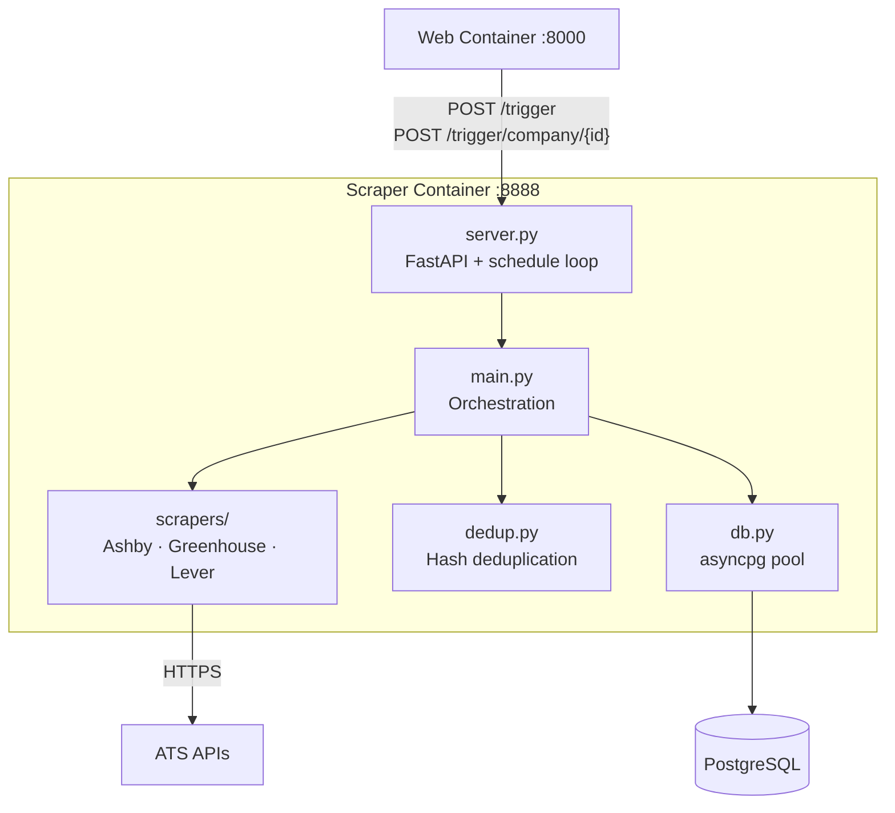
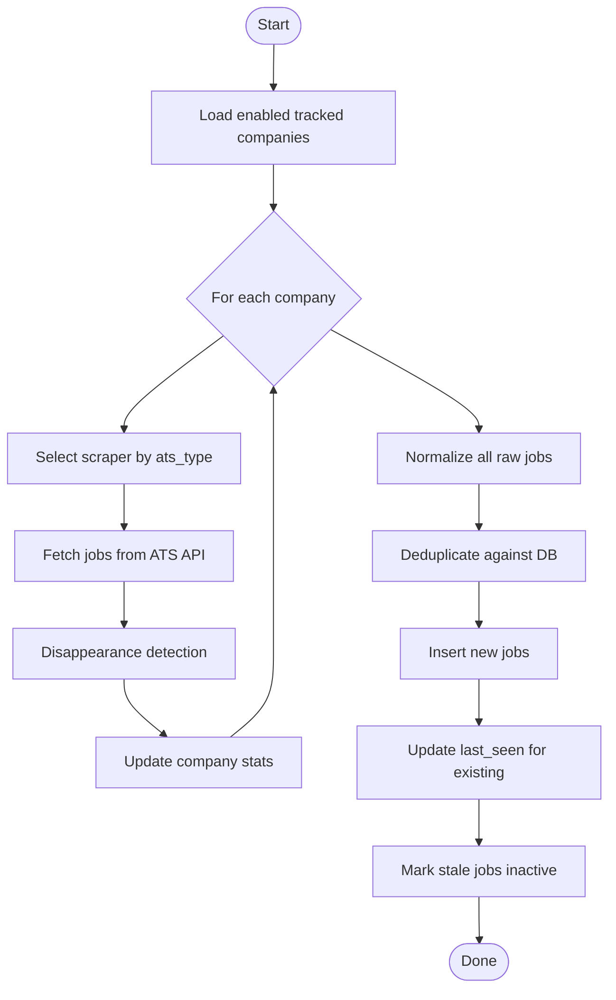

# HireWire - Scraper Service

> Design specification for the ATS scraper service that fetches, normalizes, and stores job listings from company job boards.

## Contents

- [Overview](#overview)
- [Architecture](#architecture)
- [HTTP Endpoints](#http-endpoints)
- [Scheduling](#scheduling)
- [Execution Flow](#execution-flow)
- [ATS Integrations](#ats-integrations)
- [Deduplication](#deduplication)
- [Disappearance Detection](#disappearance-detection)
- [Database Interaction](#database-interaction)
- [Configuration](#configuration)
- [Error Handling](#error-handling)

---

## Overview

The scraper runs as a **long-lived FastAPI service** (port 8888) in its own Docker container. It has two modes of operation:

1. **Scheduled** — runs a full sync at 9:00 and 17:00 UTC every day (configurable via `SCRAPE_SCHEDULE`)
2. **On-demand** — triggered via HTTP POST from the web service when a user clicks sync

The scraper only polls companies that are in the `tracked_companies` table with `enabled = true` and a valid `ats_type` + `ats_identifier`.

---

## Architecture



---

## HTTP Endpoints

All endpoints are on the scraper service at port 8888.

### `GET /health`

Returns service status and next scheduled run times.

```json
{
  "status": "ok",
  "schedule": "09:00,17:00",
  "next_runs": ["2026-02-28 09:00:00", "2026-02-28 17:00:00"]
}
```

### `POST /trigger`

Triggers a full sync of all enabled tracked companies.

**Response:**
```json
{
  "success": true,
  "new_jobs": 42,
  "updated_jobs": 108,
  "duration_ms": 3201,
  "error": null,
  "started_at": "2026-02-28T09:00:00Z"
}
```

### `POST /trigger/company/{company_id}`

Triggers a sync for a single company by its database ID.

Returns the same `SyncResponse` shape. Returns 404 if the company is not found or not enabled.

---

## Scheduling

The `schedule` Python library is used for in-process cron-style scheduling. A background `asyncio` task polls `schedule.run_pending()` every 30 seconds.

```python
# Configured via SCRAPE_SCHEDULE env var (default: "09:00,17:00")
schedule.every().day.at("09:00").do(trigger_scrape)
schedule.every().day.at("17:00").do(trigger_scrape)
```

Times are interpreted as **UTC**. To change the schedule, set `SCRAPE_SCHEDULE=HH:MM,HH:MM` in the environment.

If a scheduled run is triggered while the previous one is still in progress, it is **skipped** (not queued).

---

## Execution Flow



### Steps

1. **Load companies** — query `tracked_companies WHERE enabled = true AND ats_type IS NOT NULL`
2. **For each company** — instantiate the appropriate scraper, call `fetch()`
3. **Disappearance detection** — compare fetched `external_id` set against DB active IDs; deactivate missing ones immediately
4. **Update company stats** — write `last_scraped = NOW()` and current `job_count`
5. **Normalize** — convert `RawJob` objects to `Job` objects via `raw_job_to_job()`, generating dedup hashes
6. **Deduplicate** — batch-query existing hashes; split into new vs. existing
7. **Insert new jobs** — atomic insert of job + job_sources rows
8. **Update last_seen** — batch UPDATE for already-known jobs (prevents stale detection)
9. **Mark stale** — jobs not seen in 14+ days → `is_active = false`

---

## ATS Integrations

All scrapers extend `BaseScraper` and implement `fetch() -> list[RawJob]`.

### Greenhouse

- **API**: `GET https://api.greenhouse.io/v1/boards/{slug}/jobs?content=true`
- **Auth**: None
- **Rate limit**: Not enforced for public boards
- **Key fields**: `id`, `title`, `location.name`, `absolute_url`, `updated_at`, `content` (HTML)
- **Note**: `content` field is HTML-entity-escaped at source; `html.unescape()` is applied before storage

### Lever

- **API**: `GET https://api.lever.co/v0/postings/{slug}`
- **Auth**: None
- **Key fields**: `id`, `text` (title), `categories.location`, `categories.commitment`, `hostedUrl`, `createdAt` (ms epoch)
- **Description assembly**: Lever splits content across `description` (intro), `lists[]` (body sections), and `additional` (compensation). All three are concatenated into a single HTML string.

### Ashby

- **API**: `GET https://api.ashbyhq.com/posting-api/job-board/{slug}?includeCompensation=true`
- **Auth**: None
- **Key fields**: `id`, `title`, `location`, `isRemote`, `workplaceType`, `employmentType`, `jobUrl`, `descriptionHtml`, `publishedAt`, `compensation.compensationTiers`

### Smoke Test Results (confirmed working)

| Company | ATS | Jobs | Avg response |
|---------|-----|------|-------------|
| Notion | Ashby | ~120 | ~400ms |
| Stripe | Greenhouse | ~800 | ~900ms |
| Spotify | Lever | ~300 | ~600ms |

---

## Deduplication

Jobs are deduplicated using a **SHA-256 hash** of normalized `(company, title, location)`:

```python
combined = f"{normalize_company(company)}|{title.lower()}|{location.lower()}"
dedup_hash = hashlib.sha256(combined.encode()).hexdigest()[:32]
```

`normalize_company()` strips common suffixes (Inc, LLC, Corp, etc.) before hashing.

The hash is stored in `jobs.dedup_hash` with a `UNIQUE` constraint. On conflict, the insert is silently skipped (`ON CONFLICT DO NOTHING`) and `last_seen` is updated instead.

---

## Disappearance Detection

After each company scrape, the set of **fetched `external_id`s** is compared to the set of **currently active `external_id`s** in the database for that company+source:

```
disappeared = existing_active_ids - freshly_fetched_ids
```

Jobs in `disappeared` are immediately set `is_active = false`. This means a job that is removed from the ATS feed will be hidden from the dashboard on the **next scrape**.

In addition, the `mark_stale_jobs_inactive(days=14)` maintenance query catches any jobs that slipped through (e.g., a scrape failure) after 14 days without a `last_seen` update.

---

## Database Interaction

The scraper uses **asyncpg** (not SQLAlchemy) for all database access via a connection pool managed by the `Database` class in `db.py`.

Key operations:

| Method | Purpose |
|--------|---------|
| `get_enabled_tracked_companies()` | Load companies to scrape |
| `get_existing_hashes(hashes)` | Batch dedup check |
| `insert_jobs(jobs)` | Atomic job + source insert |
| `update_last_seen_batch(hashes)` | Touch existing jobs |
| `get_active_external_ids_for_company(id, source)` | Disappearance detection input |
| `deactivate_jobs_by_external_ids(id, source, ids)` | Mark disappeared jobs inactive |
| `update_company_after_scrape(id, count)` | Update `last_scraped` + `job_count` |
| `mark_stale_jobs_inactive(days)` | Stale job maintenance |

---

## Configuration

| Env var | Default | Description |
|---------|---------|-------------|
| `DATABASE_URL` | required | PostgreSQL connection string |
| `SCRAPE_SCHEDULE` | `09:00,17:00` | Comma-separated UTC times |
| `LOG_LEVEL` | `INFO` | `DEBUG`, `INFO`, `WARNING`, `ERROR` |
| `LOG_FORMAT` | `json` | `json` or `console` |
| `ENVIRONMENT` | `production` | `development` or `production` |

---

## Error Handling

- **Per-company errors** are caught and logged; the scraper continues to the next company. A single ATS failure does not abort the entire run.
- **HTTP timeouts** (default 30s per request) raise `ScrapingError` which is caught at the company loop level.
- **Database errors** during insert are per-job; a failed insert logs and continues.
- **Fatal errors** (e.g., DB connection failure at startup) set `ScrapeResult.success = False` and return immediately.
- **Schedule skip**: if a scheduled run fires while a previous run is in progress, it is logged and skipped.
