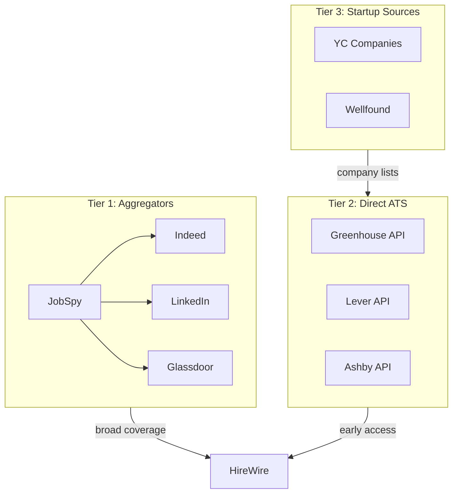

# HireWire - Scraping Tools Analysis

> Research and evaluation of available job scraping tools and their role in the HireWire stack.

## Contents

- [Overview](#overview)
- [Tier 1: Multi-Site Aggregators](#tier-1-multi-site-aggregators)
- [Tier 2: Direct ATS APIs](#tier-2-direct-ats-apis)
- [Tier 3: Startup-Focused Sources](#tier-3-startup-focused-sources)
- [Tier 4: Reference Projects](#tier-4-reference-projects)
- [Tier 5: Paid Services](#tier-5-paid-services)
- [Recommendations](#recommendations)
- [MVP Deep Dive: JobSpy](#mvp-deep-dive-jobspy)
- [MVP Deep Dive: Ashby API](#mvp-deep-dive-ashby-api)
- [Data Normalization Mapping](#data-normalization-mapping)
- [Integration Contract](#integration-contract)

## Overview

Job data can be sourced from multiple tiers, each with different trade-offs:



## Tier 1: Multi-Site Aggregators

### JobSpy (Primary Recommendation)

The main scraping library for HireWire.

**Repository**: [github.com/speedyapply/JobSpy](https://github.com/speedyapply/JobSpy) (2.6k+ stars)

**Installation**:
```bash
pip install python-jobspy
```

**Supported Sites**:
- Indeed (best - no rate limiting)
- LinkedIn (aggressive rate limiting, needs proxies)
- Glassdoor
- Google Jobs
- ZipRecruiter
- Bayt
- Naukri

**Key Parameters**:
```python
from jobspy import scrape_jobs

jobs = scrape_jobs(
    site_name=["indeed", "linkedin", "glassdoor"],
    search_term='"marketing" OR "SEO" OR "content"',
    location="Seattle, WA",
    distance=50,              # miles
    is_remote=True,           # remote filter
    job_type="fulltime",      # fulltime, parttime, internship, contract
    hours_old=24,             # only jobs posted in last 24h
    results_wanted=100,       # per site
    linkedin_fetch_description=True,  # slower but more data
    country_indeed="USA",
)
```

**Output Schema** (relevant fields):
```python
JobPost:
├── title
├── company
├── company_url
├── job_url
├── location (country, city, state)
├── is_remote
├── description
├── job_type
├── date_posted
├── min_amount, max_amount, interval  # salary
├── company_employees_label  # Indeed only - for startup filtering
├── company_industry         # LinkedIn & Indeed
```

**Filtering Capabilities**:

| Filter | At Search Time | Post-Processing |
|--------|----------------|-----------------|
| Title keywords | Yes (`search_term`) | Yes |
| Location | Yes (`location`, `distance`) | Yes |
| Remote | Yes (`is_remote`) | Yes |
| Job type | Yes (`job_type`) | Yes |
| Posted date | Yes (`hours_old`) | Yes |
| Company size | No | Yes (Indeed's `company_employees_label`) |
| Salary range | No | Yes (if provided) |

**Indeed Advanced Search Syntax**:
```python
# Use Indeed's query syntax for precise filtering
search_term = '"marketing manager" OR "SEO specialist" -senior -director'
# Quoted phrases for exact match
# OR for alternatives
# - to exclude terms
```

**Limitations**:
- LinkedIn rate limits after ~10 pages without proxies
- No direct company size filter at search time
- All sites cap at ~1000 jobs per search

**Role in HireWire**: Primary data source for broad job board coverage.

---

## Tier 2: Direct ATS APIs

These APIs let you fetch jobs directly from company career pages, often 1-3 days before they appear on aggregators.

### Greenhouse

**Endpoint**:
```
GET https://api.greenhouse.io/v1/boards/{company}/jobs
```

**Example**:
```python
import httpx

response = httpx.get("https://api.greenhouse.io/v1/boards/stripe/jobs")
jobs = response.json()["jobs"]

for job in jobs:
    print(job["title"], job["location"]["name"])
```

**Response Fields**:
- `id`, `title`, `location.name`
- `departments[].name`
- `absolute_url` (apply link)
- `updated_at`

**Companies Using Greenhouse**:
HubSpot, HelloFresh, Trivago, Datadog, Stripe, many mid-size tech companies

---

### Lever

**Endpoint**:
```
GET https://api.lever.co/v0/postings/{company}
```

**Example**:
```python
response = httpx.get("https://api.lever.co/v0/postings/figma")
jobs = response.json()

for job in jobs:
    print(job["text"], job["categories"]["location"])
```

**Response Fields**:
- `id`, `text` (title), `description`
- `categories.location`, `categories.team`, `categories.department`
- `hostedUrl`, `applyUrl`
- `createdAt`

**Companies Using Lever**:
Spotify, Atlassian, Eventbrite, Figma, Netflix

---

### Ashby

**Endpoint**:
```
GET https://api.ashbyhq.com/posting-api/job-board/{company}?includeCompensation=true
```

**Example**:
```python
response = httpx.get(
    "https://api.ashbyhq.com/posting-api/job-board/notion",
    params={"includeCompensation": "true"}
)
jobs = response.json()["jobs"]

for job in jobs:
    print(job["title"], job.get("compensation"))
```

**Response Fields**:
- `id`, `title`, `location`
- `department`, `team`
- `compensation` (if enabled)
- `publishedDate`
- `applicationUrl`

**Companies Using Ashby** (startup-heavy):
Notion, OpenAI, Duolingo, Reddit, Snowflake, Deel, Vanta, Kraken

---

### ATS Discovery Problem

These APIs require knowing the company identifier. There's no public directory of all companies using each ATS.

**Solutions**:
1. **Curate manually**: Build a list of target companies
2. **Use YC list**: Cross-reference YC companies with ATS endpoints
3. **Paid services**: Fantastic.jobs maintains lists (900+ Ashby, 1500+ Greenhouse)

**Role in HireWire**: Secondary data source for tracked companies. User adds companies to watchlist, scraper polls their ATS.

---

## Tier 3: Startup-Focused Sources

### Y Combinator Companies

A maintained CSV of ~4,000 YC companies exists on Hugging Face:
```
https://huggingface.co/datasets/jeffboudier/yc-companies-august-2025
```

**Fields**: Company name, website, description, team size, industry, funding status, hiring status

**Strategy**: Cross-reference YC companies with ATS endpoints:
1. Load YC companies CSV
2. For each company, try Greenhouse/Lever/Ashby endpoints
3. Cache successful mappings
4. Poll on schedule

---

### Wellfound (AngelList Talent)

- URL: [wellfound.com](https://wellfound.com)
- Best for: Early-stage startups (seed to Series B)
- No official API, would require scraping
- Has job alerts feature (could use as reference)

---

### BuiltIn

- Regional startup job boards (BuiltIn Seattle, NYC, etc.)
- No public API
- Good for local startup scenes

**Role in HireWire**: Seed data for company watchlists. YC list is the most actionable.

---

## Tier 4: Reference Projects

Existing open-source projects to learn from:

### job-board-scraper (Levergreen)

**Repository**: [github.com/adgramigna/job-board-scraper](https://github.com/adgramigna/job-board-scraper)

- Scrapy-based, targets Greenhouse/Lever/Ashby
- Requires maintaining a URL list in Postgres
- Has dbt transforms for data cleaning
- Runs via GitHub Actions on schedule
- Live demo: levergreen.dev

**Useful patterns**:
- Scrapy spider architecture
- Deduplication via hashing
- dbt for data transformation

---

### re-employment-kraken

**Repository**: [github.com/uschtwill/re-employment-kraken](https://github.com/uschtwill/re-employment-kraken)

- Tracks seen jobs, notifies on NEW postings only
- Good notification/dedup patterns

---

### Pathfinder

**Repository**: [github.com/KazKozDev/pathfinder](https://github.com/KazKozDev/pathfinder)

- Full job tracker (React + Node + SQLite)
- Tracks applications, interviews
- AI resume/cover letter tools
- Good UX reference for tracking features

---

## Tier 5: Paid Services

For reference if self-hosting becomes too painful.

### Fantastic.jobs

- Pre-aggregated feeds from 900+ Ashby companies, 1,500+ Greenhouse companies
- Pay-as-you-go: ~$1.20/1000 jobs
- RapidAPI and Apify integrations
- High-volume: $200-$4,000/month

**When to consider**: If ATS discovery/maintenance overhead is too high.

---

## Recommendations

### For HireWire Phase 1

**Use JobSpy as primary source**:
- Focus on Indeed (best data, no rate limits)
- Include Glassdoor for coverage
- Skip LinkedIn initially (rate limiting pain)

**Post-process for startups**:
```python
# Filter for startup-sized companies (Indeed data)
startup_sizes = ['1-10', '11-50', '51-200', '201-500']
startups = jobs[jobs['company_employees_label'].isin(startup_sizes)]
```

### For HireWire Phase 3

**Add direct ATS polling**:
1. Build company watchlist feature in UI
2. User adds companies they're interested in
3. Scraper tries Greenhouse/Lever/Ashby endpoints
4. Cache successful mappings
5. Poll watchlisted companies every 1-2 hours

**Seed with YC list**:
- Download YC companies CSV
- Pre-populate ATS mappings for known companies
- Offer as "suggested companies" in UI

### Proxy Strategy (Future)

If LinkedIn coverage becomes important:
- Use rotating residential proxies
- JobSpy supports proxy parameter
- Budget ~$20-50/month for proxy service

---

## Summary Table

| Source | Coverage | Freshness | Rate Limits | Startup Focus |
|--------|----------|-----------|-------------|---------------|
| Indeed (JobSpy) | High | 24-48h delay | None | Medium (size filter) |
| LinkedIn (JobSpy) | High | 24-48h delay | Heavy | Low |
| Glassdoor (JobSpy) | Medium | 24-48h delay | Moderate | Low |
| Greenhouse API | Medium | Real-time | None | High |
| Lever API | Medium | Real-time | None | High |
| Ashby API | Medium | Real-time | None | Very High |
| YC List | Low | N/A | N/A | Very High |

**Priority order for HireWire**:
1. Indeed via JobSpy (broad coverage, startup size filtering)
2. Ashby API (startup-heavy customer base)
3. Greenhouse API (mid-size tech)
4. Lever API (established tech)
5. LinkedIn via JobSpy (with proxies, later)

---

## MVP Deep Dive: JobSpy

> Complete API surface and implementation details for the primary data source.

### Installation & Requirements

```bash
pip install python-jobspy

# Requirements
# - Python 3.10+
# - pandas (installed as dependency)
# - httpx (installed as dependency)
```

### Complete Parameter Reference

```python
from jobspy import scrape_jobs

jobs = scrape_jobs(
    # === REQUIRED ===
    site_name: list[str],              # ["indeed", "linkedin", "glassdoor", "zip_recruiter", "google", "bayt", "naukri"]
    
    # === SEARCH PARAMETERS ===
    search_term: str = None,           # Search query (supports Indeed boolean syntax)
    location: str = None,              # City, state, or country
    distance: int = 50,                # Radius in miles from location
    
    # === FILTERS ===
    is_remote: bool = None,            # Filter remote jobs only
    job_type: str = None,              # "fulltime", "parttime", "internship", "contract"
    easy_apply: bool = None,           # LinkedIn Easy Apply filter
    
    # === RESULT CONTROL ===
    results_wanted: int = 15,          # Results per site (max ~1000)
    hours_old: int = None,             # Only jobs posted within N hours
    offset: int = 0,                   # Pagination offset
    
    # === SITE-SPECIFIC ===
    country_indeed: str = "USA",       # Indeed country code
    linkedin_fetch_description: bool = False,  # Fetch full descriptions (slower)
    linkedin_company_ids: list[int] = None,    # Filter by LinkedIn company IDs
    
    # === OUTPUT ===
    output_format: str = "dataframe",  # "dataframe" or "json"
    verbose: int = 2,                  # Logging level (0-2)
    
    # === PROXY ===
    proxies: list[str] | str = None,   # Proxy URL(s) for rate limit evasion
)
```

### Output Schema (JobPost)

The `scrape_jobs()` function returns a pandas DataFrame with these columns:

```python
class JobPost:
    """Schema returned by JobSpy for each job posting."""
    
    # === IDENTIFICATION ===
    id: str                    # Internal JobSpy ID (site-specific)
    site: str                  # Source site: "indeed", "linkedin", "glassdoor", etc.
    job_url: str               # Direct URL to job posting
    job_url_direct: str | None # Direct apply URL (if different)
    
    # === JOB DETAILS ===
    title: str                 # Job title
    company: str               # Company name
    company_url: str | None    # Company profile/website URL
    description: str | None    # Job description (HTML stripped)
    job_type: str | None       # "fulltime", "parttime", "internship", "contract"
    
    # === LOCATION ===
    location: Location         # Nested object with city, state, country
    # location.city: str | None
    # location.state: str | None  
    # location.country: str | None
    is_remote: bool            # True if remote position
    
    # === COMPENSATION ===
    min_amount: float | None   # Salary minimum
    max_amount: float | None   # Salary maximum
    currency: str | None       # Currency code (USD, EUR, etc.)
    interval: str | None       # "yearly", "monthly", "hourly", "weekly", "daily"
    
    # === DATES ===
    date_posted: date | None   # When job was posted
    
    # === COMPANY METADATA (Indeed-specific) ===
    company_employees_label: str | None  # "1-10", "11-50", "51-200", "201-500", etc.
    company_industry: str | None         # Industry category
    company_description: str | None      # Company description snippet
    company_logo: str | None             # Logo URL
    company_revenue_label: str | None    # Revenue range
    
    # === LINKEDIN-SPECIFIC ===
    job_function: str | None   # Job function category
    seniority_level: str | None # Entry, Mid, Senior, Director, etc.
    job_posting_url: str | None # LinkedIn posting URL variant
    
    # === GLASSDOOR-SPECIFIC ===
    company_rating: float | None  # Glassdoor company rating
    company_reviews_count: int | None
```

### Rate Limits & Best Practices

| Site | Rate Limit | Recommended Strategy |
|------|------------|---------------------|
| Indeed | None observed | Safe for high volume (100+ per run) |
| LinkedIn | ~10 pages without proxy | Use proxies for >100 results |
| Glassdoor | Moderate | 50-100 results per run is safe |
| ZipRecruiter | Light | 100 results per run |
| Google Jobs | Light | 50-100 results per run |

**Best Practices**:

```python
# 1. Stagger site requests to avoid rate limits
for site in ["indeed", "glassdoor"]:  # Don't parallelize
    jobs = scrape_jobs(site_name=[site], ...)
    time.sleep(2)  # Small delay between sites

# 2. Use hours_old to minimize duplicate fetches
jobs = scrape_jobs(
    hours_old=48,  # Only jobs from last 48 hours
    ...
)

# 3. For LinkedIn, always use proxies in production
jobs = scrape_jobs(
    site_name=["linkedin"],
    proxies=["http://proxy1:8080", "http://proxy2:8080"],
    ...
)

# 4. Batch by search config, not by site
# This allows different locations/terms per config
```

### Indeed Boolean Search Syntax

Indeed supports advanced query syntax in `search_term`:

```python
# Exact phrase matching
search_term = '"marketing manager"'

# OR operator
search_term = '"SEO specialist" OR "content strategist"'

# Exclude terms with minus
search_term = '"marketing" -senior -director -VP'

# Complex queries
search_term = '("marketing manager" OR "growth marketing") -senior -director'

# Title-specific (Indeed only, may not work consistently)
search_term = 'title:(marketing manager)'
```

### Error Handling

```python
from jobspy import scrape_jobs
from jobspy.exceptions import JobSpyException  # If available

def safe_scrape(config: SearchConfig) -> pd.DataFrame:
    """Scrape with error handling and retries."""
    max_retries = 3
    
    for attempt in range(max_retries):
        try:
            jobs = scrape_jobs(
                site_name=config.sites,
                search_term=config.search_term,
                location=config.location,
                hours_old=config.hours_old or 48,
                results_wanted=config.results_wanted or 100,
            )
            return jobs
            
        except Exception as e:
            logger.warning(f"Scrape attempt {attempt + 1} failed: {e}")
            if attempt < max_retries - 1:
                time.sleep(5 * (attempt + 1))  # Exponential backoff
            else:
                logger.error(f"All retries failed for config: {config.name}")
                return pd.DataFrame()  # Return empty on failure
```

### Known Limitations

1. **No company size filter at search time**: Must filter post-scrape using `company_employees_label`
2. **LinkedIn rate limiting**: Aggressive without proxies, ~10 pages max
3. **Results cap**: All sites cap at ~1000 jobs per search
4. **Description availability**: LinkedIn requires `linkedin_fetch_description=True` (slower)
5. **Salary data**: Often missing; ~20-40% of jobs have compensation info
6. **Stale data**: Jobs may have expired but still appear for 1-2 days

---

## MVP Deep Dive: Ashby API

> Complete API surface for the startup-focused ATS platform.

### Overview

Ashby is an ATS (Applicant Tracking System) used heavily by startups. Unlike Greenhouse/Lever, Ashby's public job board API requires **no authentication** for reading job listings.

**Notable Companies Using Ashby**:
Notion, OpenAI, Duolingo, Reddit, Snowflake, Deel, Vanta, Kraken, Ramp, Mercury, Vercel

### API Endpoint

```
GET https://api.ashbyhq.com/posting-api/job-board/{company_identifier}
```

**Parameters**:

| Parameter | Type | Description |
|-----------|------|-------------|
| `company_identifier` | path | Company slug (from careers URL) |
| `includeCompensation` | query | `true` to include salary data |

**Example URLs**:
```
https://api.ashbyhq.com/posting-api/job-board/notion
https://api.ashbyhq.com/posting-api/job-board/notion?includeCompensation=true
https://api.ashbyhq.com/posting-api/job-board/openai?includeCompensation=true
```

### Response Schema

```json
{
  "jobs": [
    {
      "id": "aaaaaaaa-bbbb-cccc-dddd-eeeeeeeeeeee",
      "title": "Software Engineer, Backend",
      "team": "Engineering",
      "department": "Engineering",
      "location": "San Francisco, CA",
      "locationId": "uuid-string",
      "secondaryLocations": [
        {
          "location": "New York, NY",
          "locationId": "uuid-string"
        }
      ],
      "isRemote": true,
      "employmentType": "FullTime",
      "compensation": {
        "compensationTiers": [
          {
            "title": "Tier 1",
            "min": 150000,
            "max": 200000,
            "currency": "USD",
            "interval": "Yearly"
          }
        ],
        "summaryComponents": [
          "150000.00 - 200000.00 USD Yearly Salary"
        ]
      },
      "descriptionHtml": "<p>Job description HTML...</p>",
      "descriptionPlain": "Job description plain text...",
      "publishedDate": "2025-01-15T00:00:00.000Z",
      "applicationUrl": "https://jobs.ashbyhq.com/notion/aaaaaaaa-bbbb-cccc-dddd-eeeeeeeeeeee",
      "externalLink": "https://notion.com/careers",
      "applyUrl": "https://jobs.ashbyhq.com/notion/aaaaaaaa-bbbb-cccc-dddd-eeeeeeeeeeee/application"
    }
  ],
  "departments": [
    {"id": "uuid", "name": "Engineering"},
    {"id": "uuid", "name": "Marketing"}
  ],
  "locations": [
    {"id": "uuid", "name": "San Francisco, CA"},
    {"id": "uuid", "name": "Remote"}
  ]
}
```

### Field Reference

| Field | Type | Description |
|-------|------|-------------|
| `id` | string | Unique job ID (UUID) |
| `title` | string | Job title |
| `team` | string | Team name (e.g., "Platform") |
| `department` | string | Department name |
| `location` | string | Primary location |
| `secondaryLocations` | array | Additional locations |
| `isRemote` | boolean | Whether remote work allowed |
| `employmentType` | string | "FullTime", "PartTime", "Intern", "Contract" |
| `compensation` | object | Salary/compensation data (if enabled) |
| `descriptionHtml` | string | HTML job description |
| `descriptionPlain` | string | Plain text description |
| `publishedDate` | string | ISO 8601 date |
| `applicationUrl` | string | Direct link to job page |
| `applyUrl` | string | Direct link to application form |

### Compensation Structure

```python
class Compensation:
    compensationTiers: list[CompensationTier]
    summaryComponents: list[str]

class CompensationTier:
    title: str        # "Tier 1", "Tier 2", etc.
    min: float        # Minimum salary
    max: float        # Maximum salary
    currency: str     # "USD", "EUR", etc.
    interval: str     # "Yearly", "Monthly", "Hourly"
```

**Note**: Not all companies enable compensation display. If disabled, the `compensation` field will be `null`.

### Rate Limits & Caching

| Aspect | Details |
|--------|---------|
| Rate Limit | No documented limit; practical limit ~100 req/min |
| Auth | None required for public job boards |
| Caching | Recommend caching for 1-2 hours minimum |
| Timeout | 30 second timeout recommended |

### Error Handling

```python
import httpx
from typing import Optional

class AshbyError(Exception):
    """Ashby API error."""
    pass

async def fetch_ashby_jobs(
    company: str,
    include_compensation: bool = True,
) -> Optional[dict]:
    """Fetch jobs from Ashby API with error handling."""
    
    url = f"https://api.ashbyhq.com/posting-api/job-board/{company}"
    params = {"includeCompensation": str(include_compensation).lower()}
    
    async with httpx.AsyncClient() as client:
        try:
            response = await client.get(url, params=params, timeout=30.0)
            
            if response.status_code == 404:
                # Company not found or doesn't use Ashby
                logger.warning(f"Ashby company not found: {company}")
                return None
                
            response.raise_for_status()
            return response.json()
            
        except httpx.TimeoutException:
            logger.error(f"Ashby request timed out for: {company}")
            raise AshbyError(f"Timeout fetching {company}")
            
        except httpx.HTTPStatusError as e:
            logger.error(f"Ashby HTTP error: {e.response.status_code}")
            raise AshbyError(f"HTTP {e.response.status_code} for {company}")
```

### Company Discovery

Finding Ashby company identifiers:

1. **From careers page URL**:
   ```
   https://jobs.ashbyhq.com/notion → identifier: "notion"
   https://jobs.ashbyhq.com/openai → identifier: "openai"
   ```

2. **YC Company list**: Cross-reference with YC companies dataset
   
3. **Manual curation**: Build a watchlist of target companies

4. **Third-party lists**: Fantastic.jobs maintains a list of 900+ Ashby companies (paid)

### Implementation Example

```python
class AshbyScraper:
    """Scraper for Ashby ATS job boards."""
    
    BASE_URL = "https://api.ashbyhq.com/posting-api/job-board"
    
    def __init__(self, company: TrackedCompany):
        self.company = company
        self.client = httpx.AsyncClient(timeout=30.0)
    
    async def fetch(self) -> list[RawJob]:
        """Fetch all jobs from company's Ashby board."""
        
        url = f"{self.BASE_URL}/{self.company.ats_identifier}"
        
        response = await self.client.get(
            url,
            params={"includeCompensation": "true"},
        )
        response.raise_for_status()
        data = response.json()
        
        jobs = []
        for job in data.get("jobs", []):
            # Extract primary compensation tier
            comp = job.get("compensation", {}) or {}
            tiers = comp.get("compensationTiers", [])
            tier = tiers[0] if tiers else {}
            
            jobs.append(RawJob(
                source="ashby",
                source_site="ashby",
                external_id=job["id"],
                title=job["title"],
                company=self.company.name,
                company_url=job.get("externalLink"),
                location=job.get("location"),
                is_remote=job.get("isRemote", False),
                description=job.get("descriptionPlain"),
                job_url=job.get("applicationUrl"),
                job_type=self._map_employment_type(job.get("employmentType")),
                date_posted=job.get("publishedDate"),
                salary_min=tier.get("min"),
                salary_max=tier.get("max"),
                salary_currency=tier.get("currency"),
                salary_interval=tier.get("interval"),
                department=job.get("department"),
                team=job.get("team"),
            ))
        
        return jobs
    
    def _map_employment_type(self, ashby_type: str | None) -> str | None:
        """Map Ashby employment types to normalized values."""
        mapping = {
            "FullTime": "fulltime",
            "PartTime": "parttime",
            "Intern": "internship",
            "Contract": "contract",
        }
        return mapping.get(ashby_type)
    
    async def close(self):
        await self.client.aclose()
```

---

## Data Normalization Mapping

> Mapping source fields to the HireWire PostgreSQL schema.

### Target Schema (from api-backend.md)

```sql
TABLE jobs (
    id              INTEGER PRIMARY KEY,
    dedup_hash      VARCHAR(32) UNIQUE NOT NULL,  -- SHA256(company|title|location)
    title           VARCHAR(500) NOT NULL,
    company         VARCHAR(255) NOT NULL,
    company_url     VARCHAR(500),
    location_raw    VARCHAR(255),
    location_city   VARCHAR(100),
    location_state  VARCHAR(100),
    location_country VARCHAR(100),
    is_remote       BOOLEAN DEFAULT FALSE,
    description     TEXT,
    job_url         VARCHAR(1000) NOT NULL,
    job_type        VARCHAR(50),
    salary_min      FLOAT,
    salary_max      FLOAT,
    salary_interval VARCHAR(20),
    date_posted     TIMESTAMP,
    first_seen      TIMESTAMP DEFAULT NOW(),
    last_seen       TIMESTAMP DEFAULT NOW(),
    company_size    VARCHAR(50),
    company_industry VARCHAR(100),
    is_active       BOOLEAN DEFAULT TRUE
)
```

### JobSpy → HireWire Mapping

| JobSpy Field | HireWire Field | Transform |
|--------------|----------------|-----------|
| `title` | `title` | Direct |
| `company` | `company` | Direct |
| `company_url` | `company_url` | Direct |
| `job_url` | `job_url` | Direct |
| `location.city` | `location_city` | Direct |
| `location.state` | `location_state` | Direct |
| `location.country` | `location_country` | Direct |
| (generated) | `location_raw` | `f"{city}, {state}"` |
| `is_remote` | `is_remote` | Direct |
| `description` | `description` | Direct |
| `job_type` | `job_type` | Normalize to snake_case: `full_time`, `part_time`, `contract`, `internship` |
| `min_amount` | `salary_min` | Direct |
| `max_amount` | `salary_max` | Direct |
| `interval` | `salary_interval` | Normalize to lowercase |
| `date_posted` | `date_posted` | Parse to datetime |
| `company_employees_label` | `company_size` | Direct (Indeed only) |
| `company_industry` | `company_industry` | Direct (Indeed/LinkedIn) |
| `site` | (job_sources.source_site) | Store in junction table |
| `id` | (job_sources.external_id) | Store in junction table |

### Ashby → HireWire Mapping

| Ashby Field | HireWire Field | Transform |
|-------------|----------------|-----------|
| `title` | `title` | Direct |
| (from tracked_company) | `company` | Use tracked company name |
| `externalLink` | `company_url` | Direct |
| `applicationUrl` | `job_url` | Direct |
| `location` | `location_raw` | Direct |
| (parsed) | `location_city` | Parse from location string |
| (parsed) | `location_state` | Parse from location string |
| `isRemote` | `is_remote` | Direct |
| `descriptionPlain` | `description` | Direct |
| `employmentType` | `job_type` | Map: FullTime→full_time, PartTime→part_time, etc. |
| `compensation.compensationTiers[0].min` | `salary_min` | Extract first tier |
| `compensation.compensationTiers[0].max` | `salary_max` | Extract first tier |
| `compensation.compensationTiers[0].interval` | `salary_interval` | Lowercase |
| `publishedDate` | `date_posted` | Parse ISO 8601 |
| N/A | `company_size` | Not available from Ashby |
| N/A | `company_industry` | Not available from Ashby |
| `id` | (job_sources.external_id) | Store in junction table |

### Location Parsing

```python
import re
from dataclasses import dataclass

@dataclass
class ParsedLocation:
    city: str | None = None
    state: str | None = None
    country: str | None = None

def parse_location(raw: str | None) -> ParsedLocation:
    """Parse location string into components."""
    if not raw:
        return ParsedLocation()
    
    # Handle "Remote" case
    if raw.lower().strip() == "remote":
        return ParsedLocation()
    
    # Common patterns:
    # "San Francisco, CA"
    # "San Francisco, CA, USA"
    # "New York, NY"
    # "London, UK"
    # "Remote - US"
    
    # Remove "Remote - " prefix
    raw = re.sub(r"^Remote\s*[-–]\s*", "", raw, flags=re.IGNORECASE)
    
    parts = [p.strip() for p in raw.split(",")]
    
    if len(parts) >= 3:
        return ParsedLocation(city=parts[0], state=parts[1], country=parts[2])
    elif len(parts) == 2:
        # Could be "City, State" or "City, Country"
        if len(parts[1]) == 2 and parts[1].isupper():
            # Likely US state abbreviation
            return ParsedLocation(city=parts[0], state=parts[1], country="USA")
        else:
            return ParsedLocation(city=parts[0], country=parts[1])
    elif len(parts) == 1:
        return ParsedLocation(city=parts[0])
    
    return ParsedLocation()
```

### Deduplication Hash

```python
import hashlib

def compute_dedup_hash(company: str, title: str, location: str | None) -> str:
    """
    Compute deduplication hash for a job posting.
    
    Uses SHA-256 of normalized (company, title, location) tuple.
    Returns 32-character hex string.
    """
    # Normalize inputs
    company_norm = company.lower().strip()
    title_norm = title.lower().strip()
    location_norm = (location or "").lower().strip()
    
    # Create hash input
    hash_input = f"{company_norm}|{title_norm}|{location_norm}"
    
    # Compute SHA-256 and truncate to 32 chars
    full_hash = hashlib.sha256(hash_input.encode()).hexdigest()
    return full_hash[:32]
```

---

## Integration Contract

> Pydantic models defining the interface between scrapers and the backend service.

### RawJob Model (Scraper Output)

```python
from pydantic import BaseModel, Field, field_validator
from datetime import datetime
from typing import Literal

class RawJob(BaseModel):
    """
    Raw job data from any scraper source.
    
    This is the contract between scrapers and the normalization layer.
    All scrapers must output data conforming to this model.
    """
    
    # === SOURCE IDENTIFICATION ===
    source: Literal["jobspy", "ashby", "greenhouse", "lever"]
    source_site: str  # "indeed", "linkedin", "glassdoor", "ashby", etc.
    external_id: str | None = None  # Original ID from source
    
    # === REQUIRED FIELDS ===
    title: str = Field(..., min_length=1, max_length=500)
    company: str = Field(..., min_length=1, max_length=255)
    job_url: str = Field(..., min_length=1, max_length=1000)
    
    # === OPTIONAL FIELDS ===
    company_url: str | None = Field(None, max_length=500)
    
    # Location
    location_raw: str | None = Field(None, max_length=255)
    location_city: str | None = Field(None, max_length=100)
    location_state: str | None = Field(None, max_length=100)
    location_country: str | None = Field(None, max_length=100)
    is_remote: bool = False
    
    # Job details
    description: str | None = None
    job_type: Literal["full_time", "part_time", "contract", "internship"] | None = None
    
    # Compensation
    salary_min: float | None = None
    salary_max: float | None = None
    salary_currency: str | None = "USD"
    salary_interval: Literal["yearly", "monthly", "hourly", "weekly", "daily"] | None = None
    
    # Dates
    date_posted: datetime | None = None
    
    # Company metadata (source-dependent)
    company_size: str | None = Field(None, max_length=50)
    company_industry: str | None = Field(None, max_length=100)
    
    # ATS-specific metadata
    department: str | None = None
    team: str | None = None
    
    @field_validator("job_type", mode="before")
    @classmethod
    def normalize_job_type(cls, v: str | None) -> str | None:
        """Normalize job type values to snake_case."""
        if v is None:
            return None
        # Map all variations to snake_case
        mapping = {
            "fulltime": "full_time",
            "full-time": "full_time",
            "full time": "full_time",
            "parttime": "part_time",
            "part-time": "part_time",
            "part time": "part_time",
            "contract": "contract",
            "internship": "internship",
        }
        return mapping.get(v.lower(), v.lower())
    
    @field_validator("salary_interval", mode="before")
    @classmethod
    def normalize_interval(cls, v: str | None) -> str | None:
        """Normalize salary interval values."""
        if v is None:
            return None
        return v.lower()
    
    def compute_dedup_hash(self) -> str:
        """Compute deduplication hash."""
        import hashlib
        
        company_norm = self.company.lower().strip()
        title_norm = self.title.lower().strip()
        location_norm = (self.location_raw or "").lower().strip()
        
        hash_input = f"{company_norm}|{title_norm}|{location_norm}"
        return hashlib.sha256(hash_input.encode()).hexdigest()[:32]

    class Config:
        extra = "ignore"  # Ignore extra fields from sources
```

### NormalizedJob Model (Database Input)

```python
class NormalizedJob(BaseModel):
    """
    Normalized job ready for database insertion.
    
    This model represents the final processed form after
    normalization and enrichment.
    """
    
    # Deduplication
    dedup_hash: str = Field(..., min_length=32, max_length=32)
    
    # Core fields
    title: str
    company: str
    company_url: str | None
    job_url: str
    
    # Location
    location_raw: str | None
    location_city: str | None
    location_state: str | None
    location_country: str | None
    is_remote: bool
    
    # Details
    description: str | None
    job_type: str | None
    
    # Compensation
    salary_min: float | None
    salary_max: float | None
    salary_interval: str | None
    
    # Dates
    date_posted: datetime | None
    
    # Metadata
    company_size: str | None
    company_industry: str | None
    
    # Source tracking (for job_sources table)
    sources: list["JobSourceRecord"]

class JobSourceRecord(BaseModel):
    """Record for job_sources junction table."""
    source: str       # "jobspy", "ashby", etc.
    source_site: str  # "indeed", "linkedin", "ashby", etc.
    external_id: str | None
```

### Scraper Interface

```python
from abc import ABC, abstractmethod

class BaseScraper(ABC):
    """Base interface for all job scrapers."""
    
    @abstractmethod
    async def scrape(self) -> list[RawJob]:
        """
        Execute scrape and return raw job data.
        
        Returns:
            List of RawJob objects conforming to the integration contract.
            Empty list on failure (after logging error).
        """
        pass
    
    @abstractmethod
    def get_source_name(self) -> str:
        """Return the source identifier (e.g., 'jobspy', 'ashby')."""
        pass

class JobSpyScraper(BaseScraper):
    """JobSpy scraper implementation."""
    
    def __init__(self, config: SearchConfig):
        self.config = config
    
    def get_source_name(self) -> str:
        return "jobspy"
    
    async def scrape(self) -> list[RawJob]:
        # Implementation details in scraper-service.md
        pass

class AshbyScraper(BaseScraper):
    """Ashby ATS scraper implementation."""
    
    def __init__(self, company: TrackedCompany):
        self.company = company
    
    def get_source_name(self) -> str:
        return "ashby"
    
    async def scrape(self) -> list[RawJob]:
        # Implementation details above
        pass
```

### Scraper Result Model

```python
class ScrapeResult(BaseModel):
    """Result from a single scraper run."""
    
    source: str
    config_name: str | None = None  # For JobSpy search configs
    company_name: str | None = None  # For ATS scrapers
    
    jobs: list[RawJob]
    
    # Metrics
    jobs_found: int
    jobs_new: int = 0  # Set after dedup
    jobs_updated: int = 0
    
    # Status
    success: bool
    error_message: str | None = None
    duration_ms: int
    
    started_at: datetime
    completed_at: datetime

class ScrapeRunSummary(BaseModel):
    """Summary of a complete scrape run across all sources."""
    
    run_id: str  # UUID for this run
    started_at: datetime
    completed_at: datetime
    
    results: list[ScrapeResult]
    
    # Aggregate metrics
    total_jobs_found: int
    total_jobs_new: int
    total_jobs_updated: int
    total_errors: int
    
    @property
    def success_rate(self) -> float:
        if not self.results:
            return 0.0
        successful = sum(1 for r in self.results if r.success)
        return successful / len(self.results)
```

---

## Open Questions

1. **Proxy Strategy**: Should we bundle proxy configuration in the MVP or defer?
   - Recommendation: Defer. Indeed doesn't need proxies, and Ashby is direct API.

2. **Company Size from Ashby**: Ashby doesn't provide company size data.
   - Option A: Leave blank for Ashby jobs
   - Option B: Cross-reference with external data (Crunchbase, LinkedIn)
   - Recommendation: Option A for MVP, consider enrichment later

3. **Multi-location Jobs**: Ashby supports `secondaryLocations`. How to handle?
   - Option A: Store only primary location
   - Option B: Create multiple job records (one per location)
   - Recommendation: Option A for MVP, reduces complexity

4. **Dedup Hash Stability**: What if company names vary slightly across sources?
   - "Notion Labs" vs "Notion" would create duplicates
   - Consider company name normalization layer in Phase 2

---

## Related Documents

- [scraper-service.md](scraper-service.md) — Scraper CronJob implementation
- [api-backend.md](api-backend.md) — Database schema and API endpoints
- [README.md](README.md) — Project overview and roadmap
